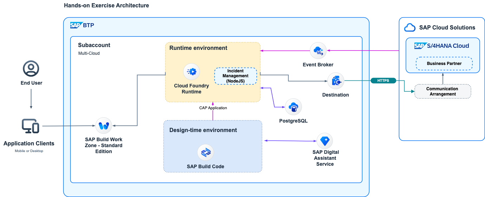

# Getting Started - Preparation
---
Let's start the exercise and check if everything is ready to go.
Please make sure you have completed all the necessary prerequisites listed below. If not, please raise your voice so that we can assist you early in the session.

## Prerequisites
Please keep the following links and resources available:

1. Make sure you have access to a browser, preferably Google Chrome.
2. Log on to the Development Lobby  

4.  If you will deploy all the the artifacts to the same SAP BTP account, and having different names and identifiers is important to avoid clashes. please use a reference to your **XXX** number. Make sure that you remember it well.

## Hands-on Architecture

1. Please subscribe the required BTP services before your hands-on exercises: [Setup Guide](https://dam.sap.com/mac/u/a/C5HSPyJ.htm?rc=10&doi=SAP1080426)

## Import the S/4HANA Cloud integration destination

> Download a sample destination for S/4HANA Cloud [S4HC](https://robin-qiu.github.io/BTP-CAP-Development-with-SAP-Build-Code---Bring-Your-Own-Tenant/vx_attachments/477573873607615/ADOPTION_LAB_API_BUSINESS_PARTNER ':include')  :truck::truck::truck:.

2. Import the destination into your BTP subaccount.

3. The credential will be supplied during the adoption lab hands-on session.

