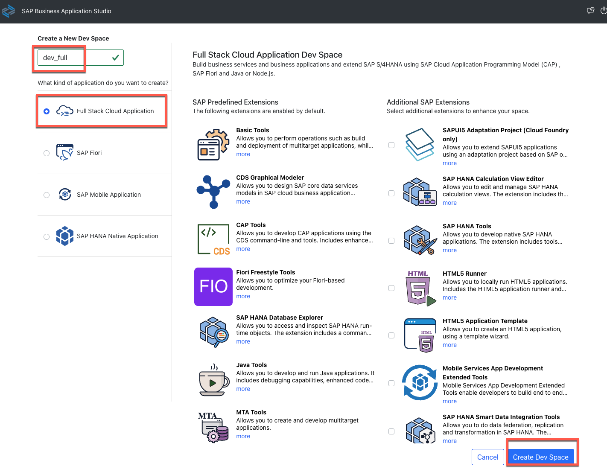

# 开始准备 - **CN40环境**
---
让我们开始练习，并检查是否一切就绪。
请确保您已完成以下所有必要的先决条件。如果遇到问题，请利用<mark>ZOOM会议**举手**</mark>功能，我们会按顺序帮忙检查。

## 先决条件
请保留以下链接和资源：

1. 确保您已访问浏览器（最好是Google Chrome）。
2. 登录到 BTP 主控室，已经激活 SAP Business Application Studio

4. 如果您有多位同事会部署到同一 SAP BTP 账户，请用不同名称和标识以避免冲突，可以后缀**XXX**号以区分。

## 实操架构

1. 在进行动手操作练习之前，请订阅所需的 BTP 服务：

## 导入 S/4HANA Cloud 集成目的地

> 下载用于 S/4HANA Cloud 的示例目标 [ADOPTION_LAB_API_BUSINESS_PARTNER](https://robin-qiu.github.io/BTP-CAP-Development-with-SAP-Build-Code---Bring-Your-Own-Tenant/vx_attachments/477573873607615/ADOPTION_LAB_API_BUSINESS_PARTNER ':include')  :truck::truck::truck:。

2. 将目标导入您的 BTP 子账户。

3. 在动手实验室期间，会提供密码（如果不清楚，请在练习时询问讲师）。

4. 如果您尝试“**检查连接**”，则会收到 **"200: OK"** 消息，并且这是正常反馈。

5. 在 SAP Business Application Studio 中创建全栈云应用开发空间，后续的练习会在这个环境中进行。
