

# 练习1 - 创建一个新的项目和创建数据模型
---
#### 在此练习中，我们将在 SAP Business Application Studio 的新低代码视角中创建一个 **incident_management** 项目。

1. 打开您的浏览器，启动 SAP Business Application Studio。
 
2. Dev Sapces 下可能已经包含多个用于不同开发场景的 Space，进入一个可以进行 "Full Stack Cloud Application"开发的 Space。
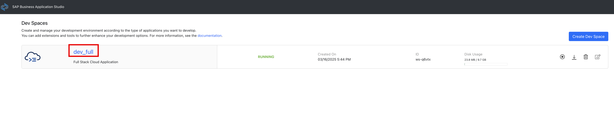

3. 在 Get Started 页面，选择 **New Project from Template**。
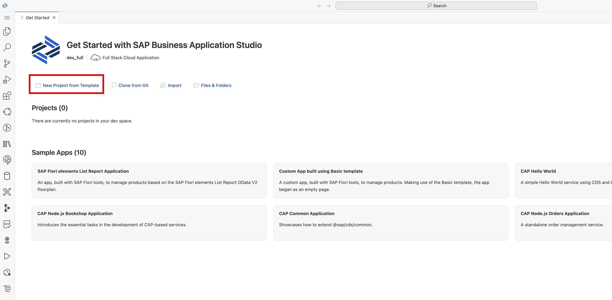

4. 然后选择 **CAP Project** 模版，点击 **Start** 按钮。
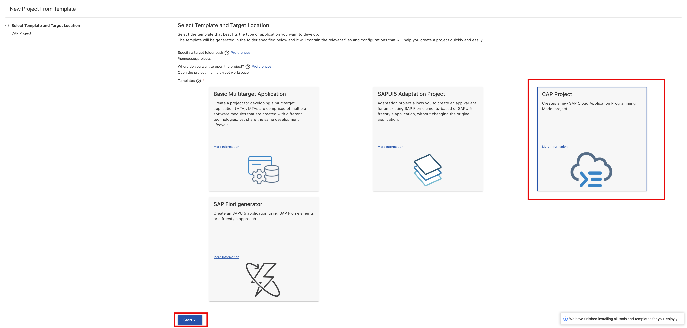

5. 将出现一个对话框，您可以在其中输入以下项目名称。由于我们计划部署我们的项目，因此在此处遵循命名约定非常重要。

**尽量按照练习中的命名创建项目，以免后续的练习代码中需要查找调整**

必须将项目命名为 `incident_managementXXX` ，其中 XXX 是分配给您的用户编号。请确保您所在BTP环境所创建的项目不要与其他同事的项目冲突。建议借助用户编号以避免与其他人的部署冲突。如果您的用户编号是 **007**，则项目名称应为 **incident_management007**

选择以下配置：

|                              配置项                               |                             值                              |
| ---------------------------------------------------------------- | ---------------------------------------------------------- |
| **Select your runtime.**                                         | Node.js                                                    |
| **Choose a database for your application.**                      | SAP HANA Cloud (如果需要部署到PostgreSQL，可自行选择)           |
| **Choose which way to deploy your project.**                     | Cloud Foundry: MTA Deployment                              |
| **Choose productive runtime capabilities for your application.** | SAP BTP Authorization and Trust Management Service (XSUAA) |

点击 **Finish** 确认创建。

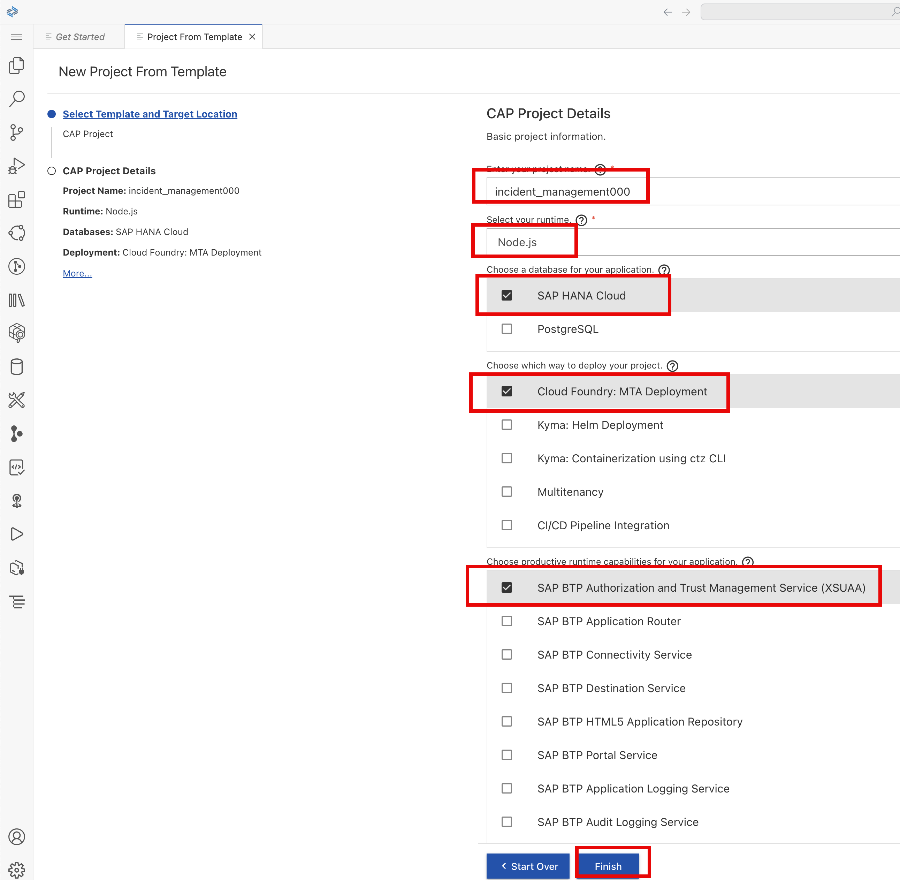

6. 选择 **incident_managementXXX**,  打开项目，可以看到模版创建的文件夹结构
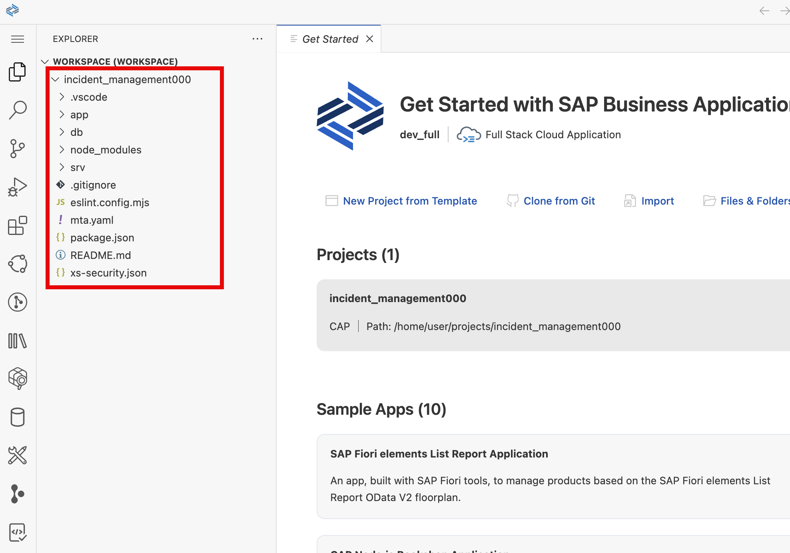

7. 点击左下角齿轮图标，打开 Command Palette...
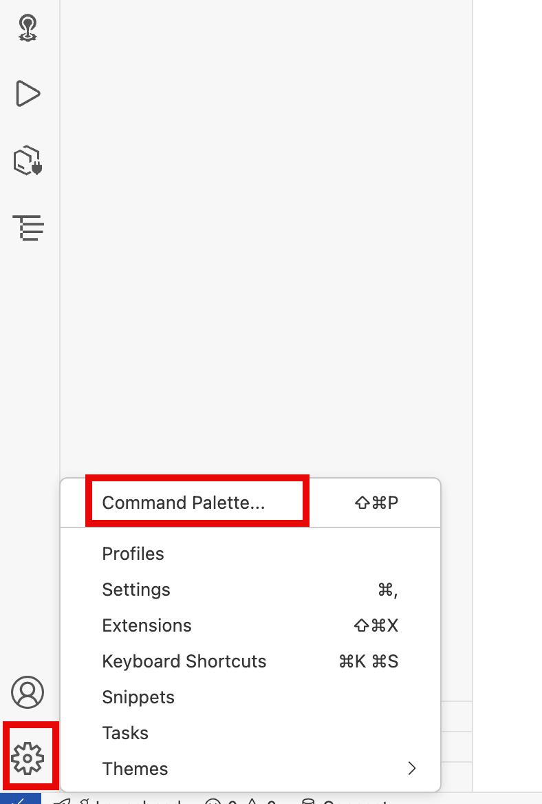

8. 输入 **Storyboard**，点击 **Open Storyboard**。
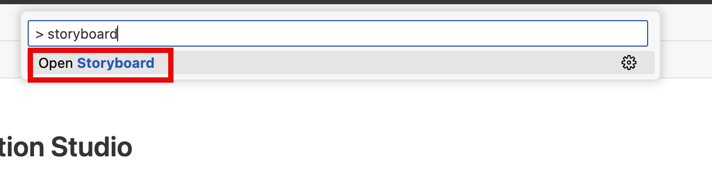

选择你创建的项目路径
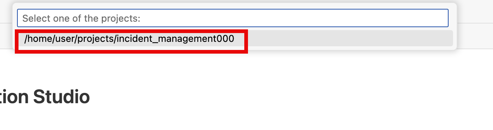

9. 在 SAP Business Application Studio 中导航到故事板，您应看到如下所示的界面。

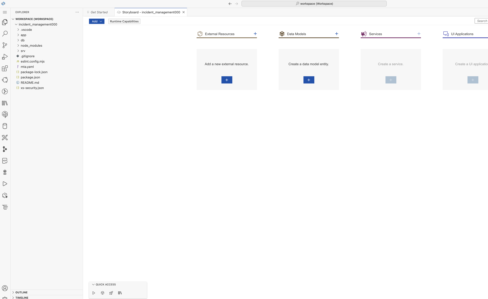

10. 现在，我们可以构建我们的项目，并使用 SAP 官方推荐的技术（例如 CAP 云应用程序编程模型 和 SAP Fiori elements），而不必担心如何结构化我们的项目。我们可以专注于需要执行的任务，而不是花费大量时间思考项目的设置和连接技术。

在下一步中，我们将创建一个数据模型。
## 总结
已经成功创建了一个基于 CAP（云应用程序编程模型）的默认 **处理器** 服务的事件管理项目，该服务现在已准备好进行建模。

---
接下来，在此练习中，我们将使用 SAP Business Application Studio 的新高生产力工具来创建一个数据模型，以持久化我们的业务数据。您将在稍后的步骤中将数据暴露为 OData 服务供其他应用程序使用。
#### 导入代码列表到数据模型
1. 在故事板中，点击 **+** 按钮下的 **数据模型** 标题，并输入 **命名空间**（例如：iac_adoptionlab）。点击创建以打开 CDS 图形建模器。
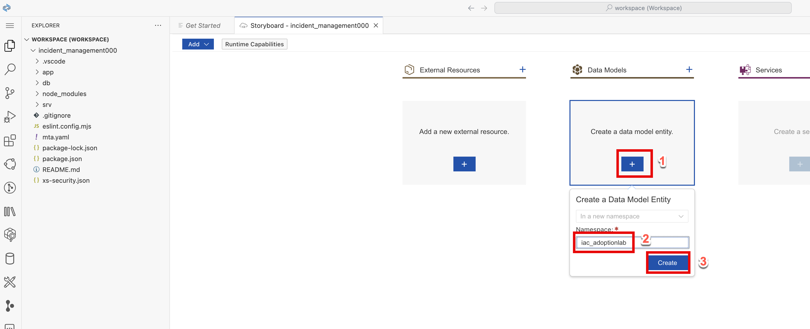

2. 在 CDS 图形建模器编辑器的画布上双击，或者从右上方工具栏点击 **打开属性表** 图标。
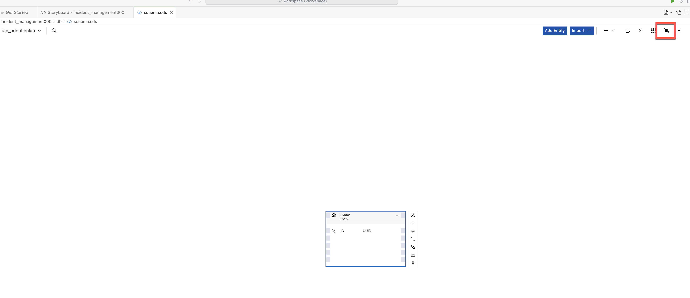

点击导入标签页，点击 **+**（从其它模型导出），然后选择 **通用类型**。
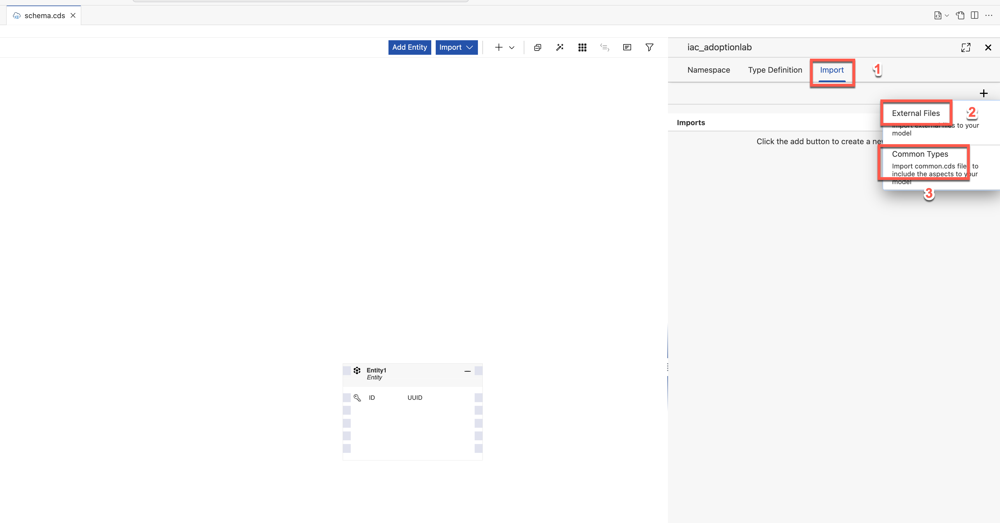

3. 在对话框中，选择 **sap.common.CodeList** 复选框，并保持其他默认选项不变。
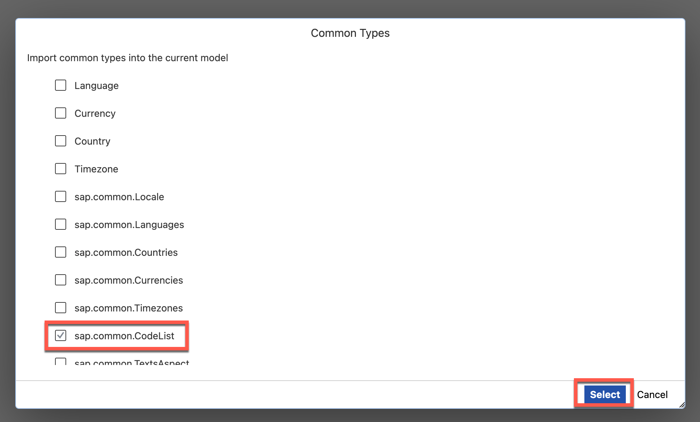

4. 数据类型已导入到模型中。稍后将在 **Urgency** 实体中使用此数据类型作为属性。

### 添加事件实体
创建包含属性和注解的 **Incidents** 实体。
在 CDS 图形建模器中，更改实体标题为 **Incidents**。

注意 ID 属性已为您创建方便。我们保留原样不变。

5. 在 Incidents 编辑器中，点击 **属性** 标签页，并然后点击 +（添加属性）。

对于 Name 列，输入值为 **title**。
其余列保持默认值不变。
实体已更新新属性。

6. 在 Incidents 编辑器中，点击 **注解** 标签页。

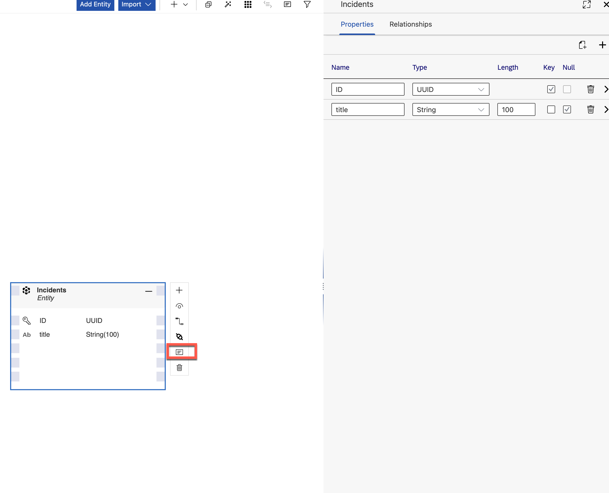

7. 点击 +（添加）旁边的 **title** 行。
对于注解目标，从下拉列表中选择 **title**；
对于注解值，输入 **Title**。

实体已更新并添加新的注解。
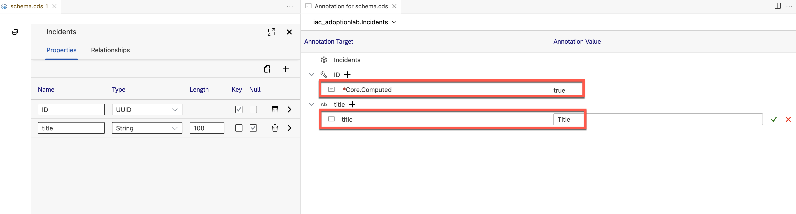

#### 添加对话实体
1. 创建包含属性，注解和方面的 **Conversations** 实体。
在 CDS 图形建模器中，点击 + 添加实体，并点击画布。更改标题为 **Conversations**。

2. 在 **Conversations** 编辑器中，点击 **属性** 标签页。（如果编辑器尚未打开，则可以点击实体上的显示详细信息图标以打开）
点击 +（添加属性）为以下字段：
a. 对于 Name 列，输入值 **timestamp**。对于 Type 列，输入 **DateTime**
其余列保持默认值不变。
b. 对于 Name 列，输入值 **author**。
其余列保持默认值不变
c. 对于 Name 列，输入值 **message**。
其余列保持默认值不变

实体已更新新的属性。

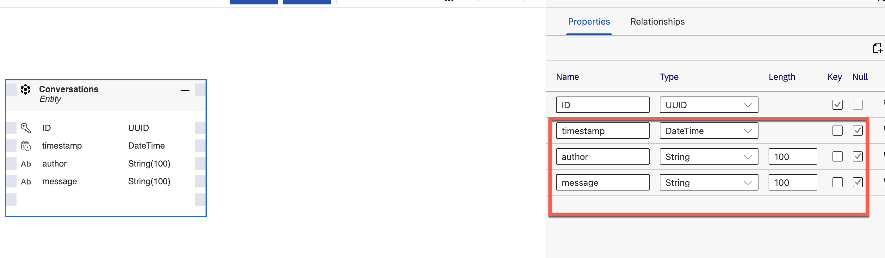

3. 在对话编辑器中，点击 **注解** 标签页。

点击 +（添加）旁边的 **timestamp**。
a. 对于注解目标，从下拉列表中选择 **cds.on.insert**；
b. 对于注解值，从下拉列表中选择 **$now**

4. 点击 +（添加）旁边的 **author** 行。
a. 对于注解目标，从下拉列表中选择 **cds.on.insert**；
b. 对于注解值，从下拉列表中选择 **$user**

实体已更新新的注解。
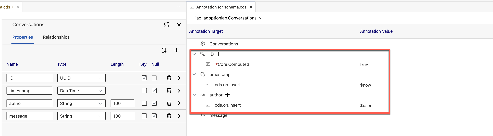

#### 添加紧急程度枚举
1. 在 CDS 图形建模器中，点击 + 并选择从下拉菜单中的添加枚举，并然后点击在画布上。更改标题为 **UrgencyCode**。
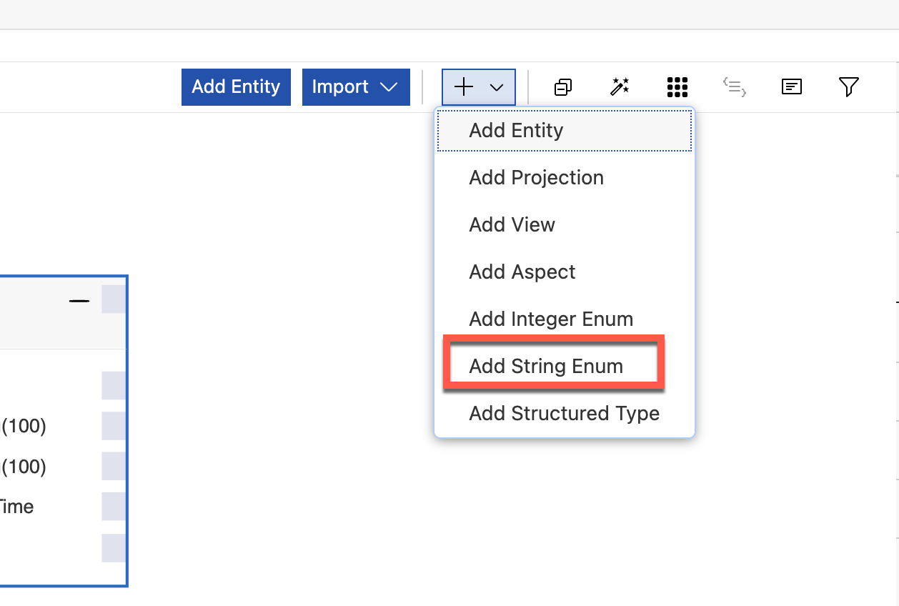

2. 如果没有打开，点击显示详细信息图标以在右侧打开 **UrgencyCode** 编辑器。

在 UrgencyCode 编辑器中，点击 **属性** 标签页。
a. 选择字符串单选按钮；
b. 对于枚举符号列，输入 **High**；
c. 对于枚举值列，输入 **H**；
d. 点击 +（添加枚举符号）；
e. 对于枚举符号列，输入 **Medium**；
f. 对于枚举值列，输入 **M**；
g. 点击 +（添加枚举符号）；
h. 对于枚举符号列，输入 **Low**；
i. 对于枚举值列，输入 **L**

UrgencyCode 实体已更新新的属性。

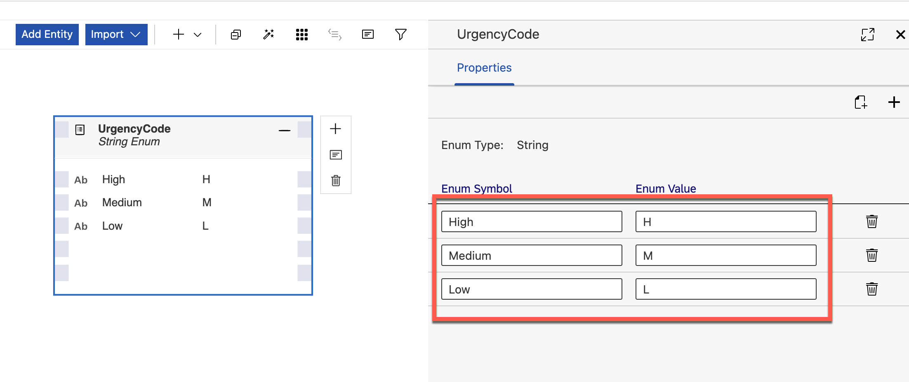

#### 添加紧急程度实体
1. 基于 UrgencyCode 枚举创建 Urgency 实体，并添加代码列表方面。

在 CDS 图形建模器中，点击 + 添加实体。
更改标题为 **Urgency**。但是这次我们将会改变它。

2. 点击显示详细信息图标。右侧将打开一个新的Urgency编辑器。
在 Urgency 编辑器中，点击 **属性** 标签页。

a. 更改 ID 属性为 code；
b. 改变 UUID 类型，为先前创建的 UrgencyCode；
c. 对于其余列，请保持默认值不变。

实体已更新新的属性。

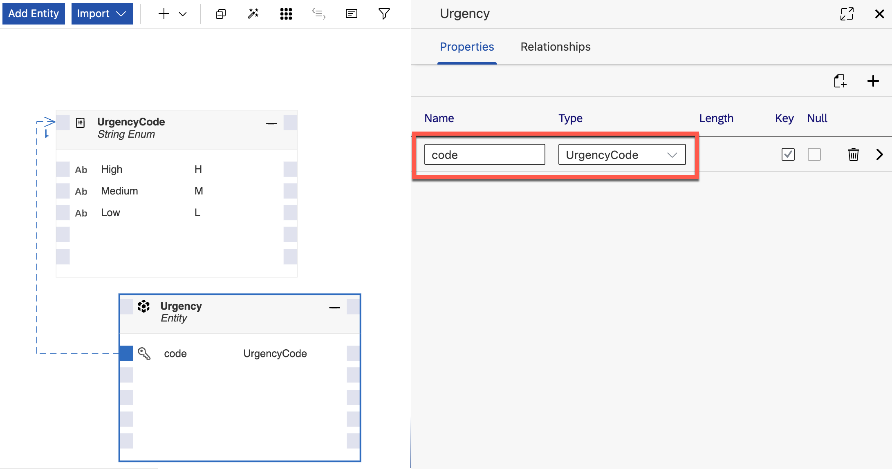

3. 在 Urgency 编辑器中，点击 **方面** 标签页。
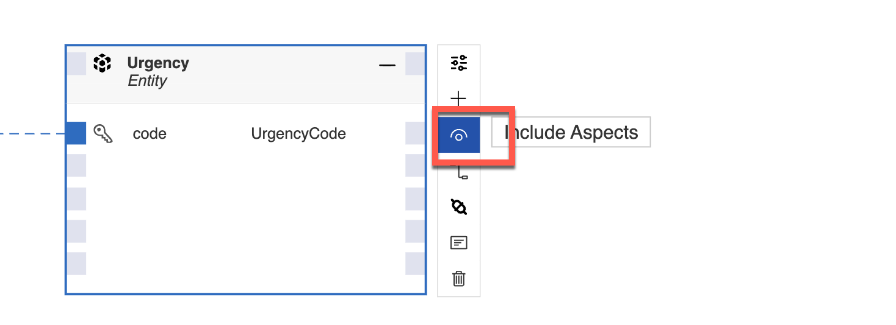

4. 选择 sap.common.CodeList 方面复选框。

实体已更新新的方面。

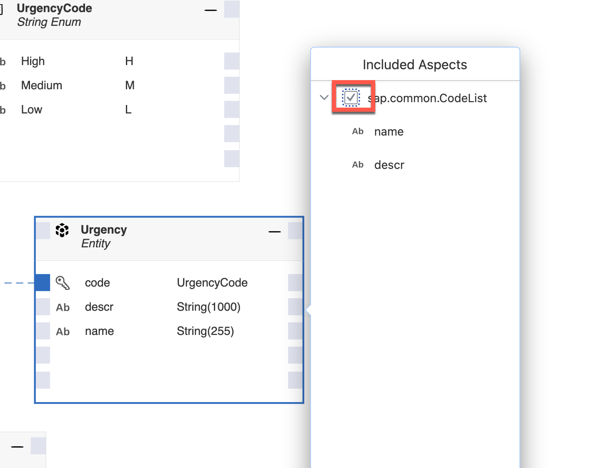

#### 添加实体关联

1. 在 **Incidents** 实体和 **Conversations** 以及 **Urgency**之间创建关联。一个事件包括紧急程度，并且多个对话。

a. 选择 Incidents 实体并点击添加关联图标。
b. 出现一个箭头。将箭头拖动到 Conversations 实体上。
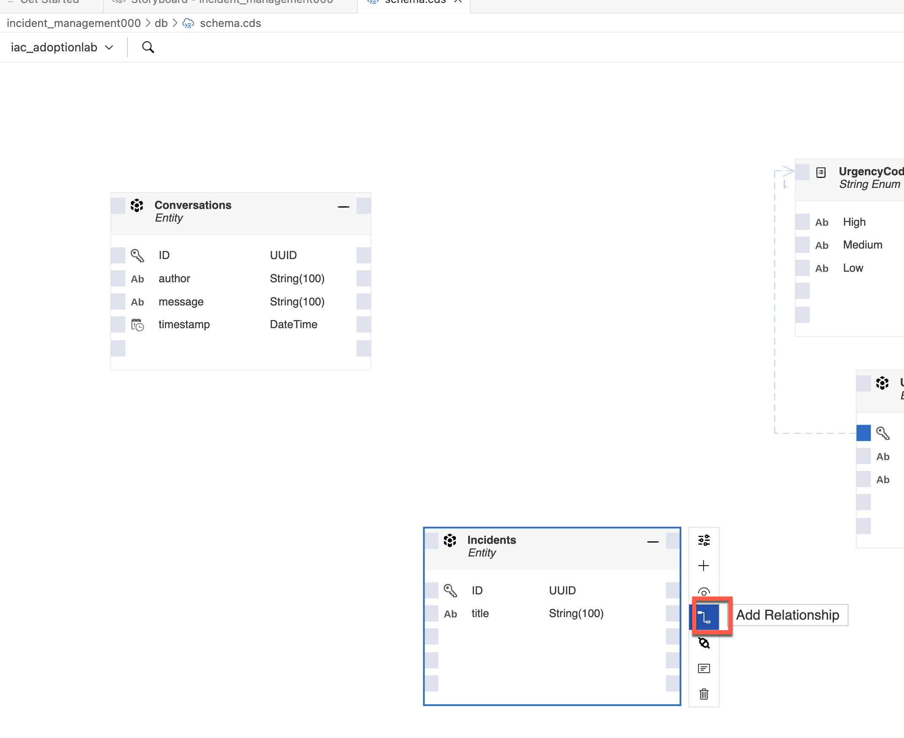
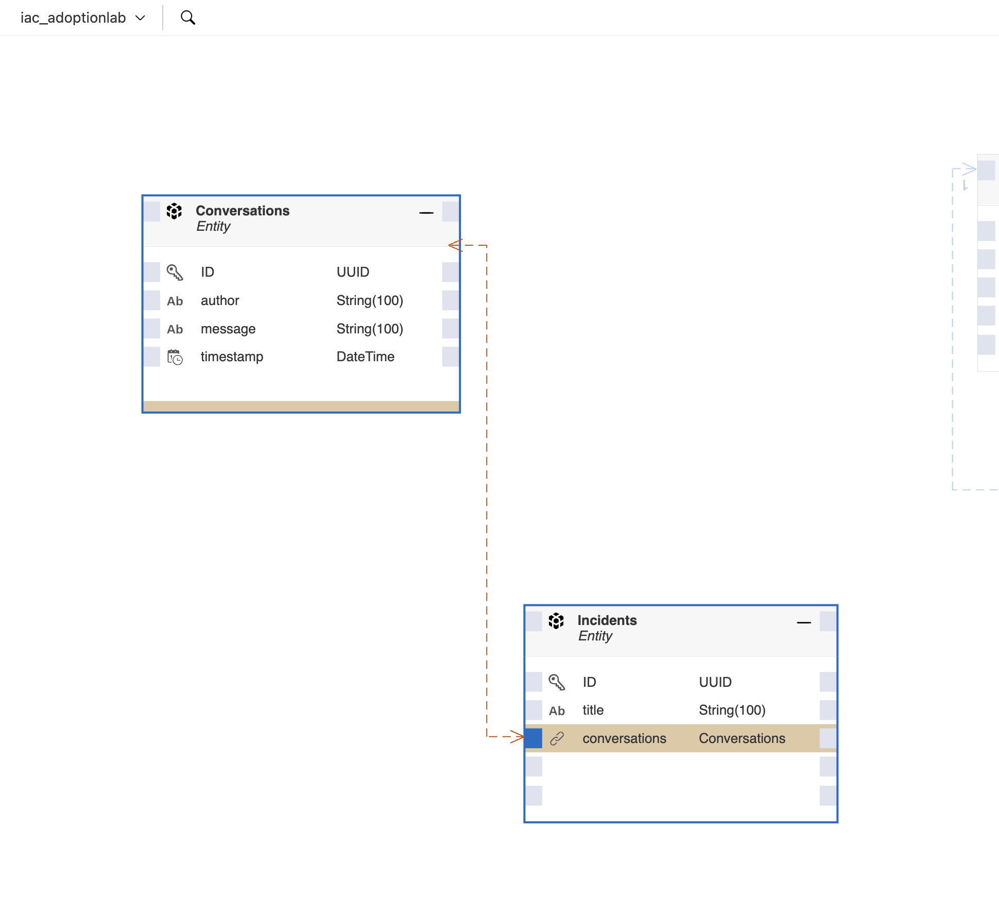

2. 将打开新的关联对话框。
在对话框中，填写以下值：
a. 对于类型，选择组合；
b. 对于多重性，选择多对一；
c. 其余字段保持默认值不变。
d. 点击 **OK** 创建。

Incidents 实体已更新新的关联到 Conversations。

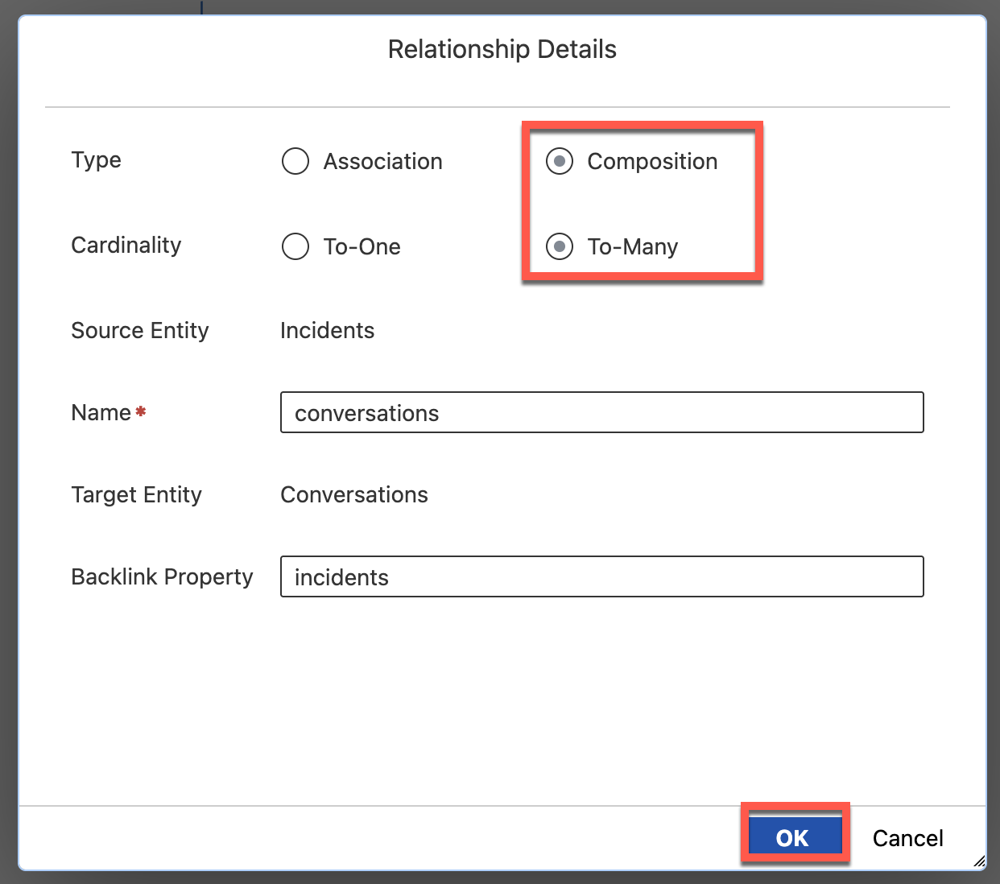

3. 对于 **Incidents** 实体**重复以上步骤**
出现一个箭头。将箭头拖动到 **Urgency** 实体上。
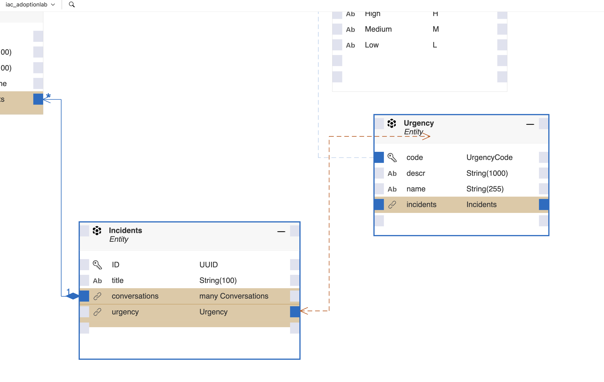

将打开新的关联对话框。
在该对话框中填写以下值：
a. 对于类型，选择关联；
b. 对于多重性，选择一对一；
c. 其余字段保持默认值不变；
d. 点击 创建。
 
Incidents 实体已更新新的关联到 Urgency。

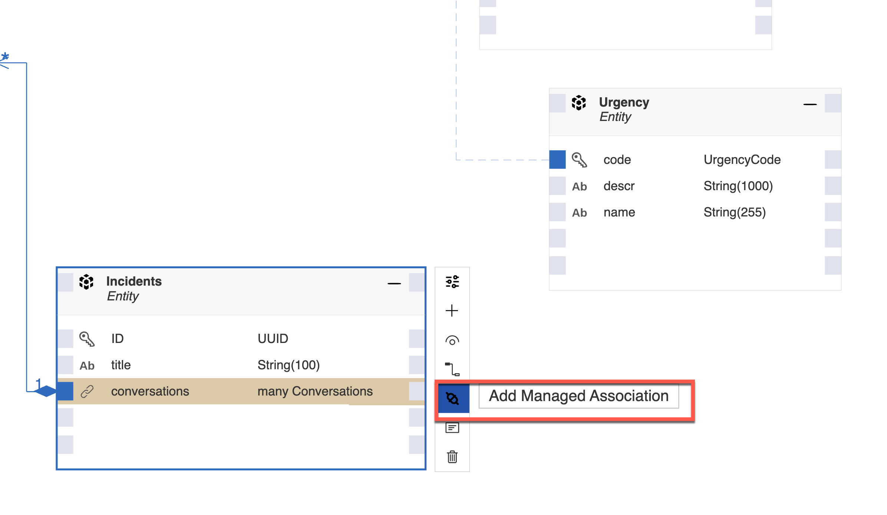

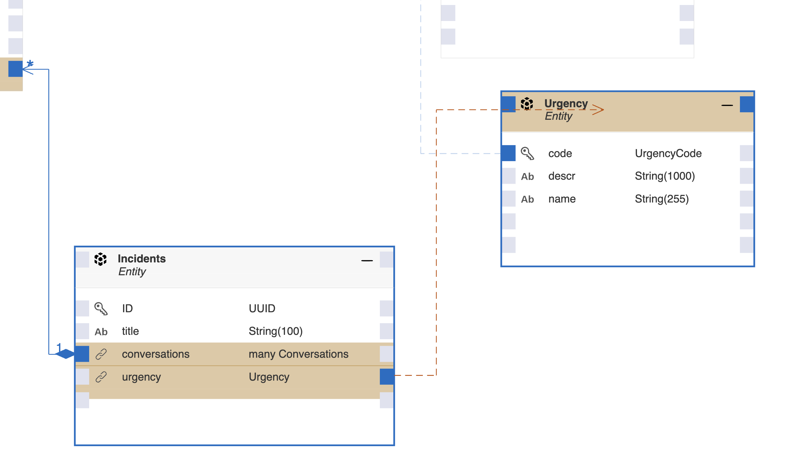

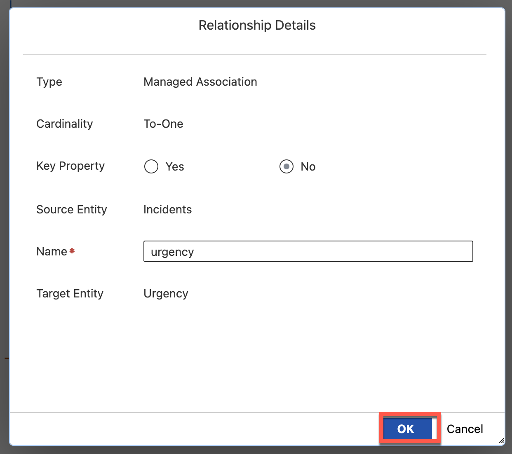

## 总结

已经创建了一个包含持久化的数据模型，该数据模型可以用于后续部署到我们将使用的 SAP HANA 数据库中。请注意，您尚未看到任何与 CAP 相关的命令或语法。