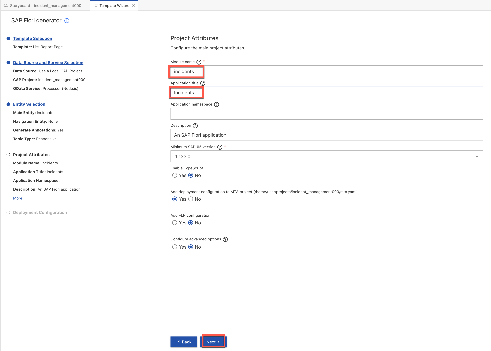
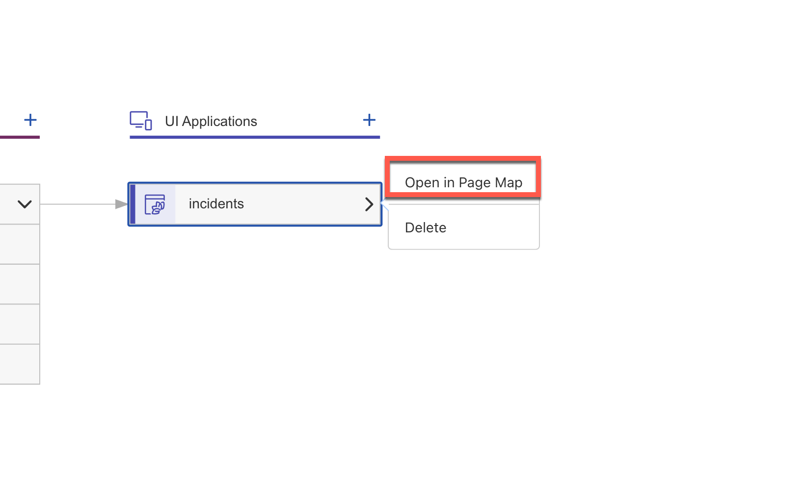
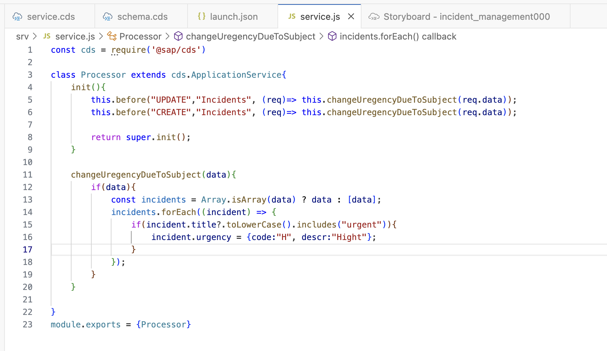

<div class="draftWatermark"></div>

# 练习3 - 创建列表报告UI应用并部署到SAP BTP上的 HANA Cloud / PostgreSQL（超大规模选项）

---

在创建了一个包含多个实体的服务之后，我们现在将基于SAP Fiori元素技术来创建一个列表报告UI应用。

## 创建一个新的UI应用

1. 回到SAP Business Application Studio中的**Storyboard**标签页。<br>
在**UI Applications**标签页中点击+(添加UI)按钮。<br>
UI应用向导打开。<br>


2. 对于**UI应用模板**,点击**列表报告页面**图标，然后点击**下一步**。


从**数据源**下拉列表选择**Use a Local CAP Project**。<br>
从**CAP Project**下拉列表选择**incident_managementXXX**。<br>
从**OData service**下拉列表选择**Processor (Node.js)**。<br>
点击**下一步**。<br>


从**Main entity**下拉列表选择**Incidents**。<br>
从**Navigation entity**下拉列表选择**None**。<br>
从**Table type**下拉列表选择**Responsive**。<br>
点击**下一步**。<br>


3. 在**Project Attributes**步骤中，填写如下内容：

在**Module name**文本框内输入**incidents**。<br>
从**Application title**文本框内输入**Incidents**。<br>
点击**Next**。



4. 在**Deployment Configuration**步骤中，填写如下内容：

从**Destination name**下拉列表选择**ADOPTION_LAB_API_BUSINESS_PARTNER - https://my300047.s4hana.ondemand.com/sap/opu/odata/sap/API_BUSINESS_PARTNER**。<br>
点击**Finish**。


5. 就这样，你只需四步就创建了一个完整的UI应用。几秒钟后，新的UI应用在**Storyboard**标签页的**UI Applications**图标中显示。<br>
几秒钟后，页面映射编辑器从侧面弹出，显示为UI应用生成的页面。


我们现在拥有一个功能齐全的列表报告和对象页面。这两个页面都自动填充了Incidents服务实体中的所有字段，除了那些不合理显示的字段。例如，包含UUID的ID字段并未被包括在内，因为显示这些唯一标识符并不会为用户提供友好的体验。

虽然我们现在可以开始测试我们的UI应用并且得到一个不错的结果，但我们还需要优化一些界面区域。

## 调整列表页面的UI应用

1. 点击“Open in Page Map”进行页面设计


2. 从页面映射编辑器选择**列表报告**图标，点击配置页面的铅笔图标。


3. 你现在可以看到这个页面的详细信息。<br>
展开**表格**部分下的**列**，查看服务实体的属性。它应该看起来像下面这样：


4. 点击**urgency_code**，并在右侧进行如下更新：

a. 将**标签**改为**紧急程度**并点击回车，让它看起来更好。
b. 从**文本**下拉列表选择**urgency/descr**。
c. 从**文本布局**下拉列表选择**仅显示文本**。这将配置列表显示紧急程度的描述而不是代码。


5. 在**表格 > 列**下选择**customer_BusinessPartner**。

将**标签**改为**客户**并按回车键让它看起来更好。


6. 选择**表格**。
从**初始加载**下拉列表选择**启用**。

这将使数据的初始加载有效，因此无需点击**Go**按钮来加载它。


## 调整UI对象页面并添加帮助值

1. 点击编辑器顶部的**Page Map**回到页面映射。<br>
选择**对象页面**图标，并点击配置页面的铅笔图标。


2. 选择**头部**部分。 <br>
从**标题**下拉列表选择**title**，这样事件的标题就可以出现在头部。


3. 在**部分**下，选择**General Information**来更新紧急程度和客户字段的标签及帮助值。

从**一般信息 > 表单 > 字段**选择**urgency_code**。<br>

在右侧打开的面板中的**标签**字段中，将文本更改为**紧急程度**并回车。<br>
从**文本**下拉列表选择**urgency/descr**。 <br>
从**文本布局**下拉列表选择**仅显示文本**。 <br>
从**显示类型**下拉列表选择**帮助值**。


4. “定义帮助值属性”对话框打开。

在**标签**字段中输入**紧急程度**。<br>
从**值描述属性**下拉列表选择**descr**。<br>
从**文本布局**下拉列表选择**仅显示文本**。

保持“以下拉形式展示”选项不变，点击应用。


5. 接下来我们将对客户列进行类似的步骤处理。<br>
这一次我们不再创建下拉列表而是帮助值，因为我们预计从后台获取的客户列表过大无法在下拉列表中展示。

从**General Information > Form > Fields**,选择 **customer_BusinessPartner**。<br>

在右侧打开的面板中，在**标签**字段中将文本更改为**客户**,并按Enter。
从**文本**下拉列表选择 **customer_BusinessPartner**。 <br>
从**文本布局**下拉列表选择 **仅显示文本**。 <br>
从**显示类型**下拉列表，选择**帮助值**。<br>


6. **Define Value Help Properties对话框弹出。**
在**显示为下拉列表**选项旁打勾,然后点击**添加列**。
从**属性**下拉菜单中选择 **FirstName**。 <br>  
点击 **添加列**。<br>
从**属性**下拉菜单中选择 **LastName**。 <br> 
点击应用。


## 添加对象页面的对话部分

1. 现在我们将添加“对话”部分到“一般信息”的旁边。

选择**部分**,点击+ (创建部分),并选择**添加表格部分**。<br>


2. “添加表格部分”对话框打开。

在**标签**字段中输入“对话”，并点击“Enter”。<br>
从“值源”下拉列表选择**conversations**。<br> 
点击**添加**。


3. 选择**对话 > 表格 > 列**,点击加号图标，然后选择“添加基本列”。


4. “添加基本列”对话框打开。
从**VColumns下拉列表中选择**author**, **timestamp**, 和 **message**。<br>
点击“添加”。


关闭页面映射编辑器，并导航回到Storyboard标签页。

## 总结
你现在已经为你的项目添加了一个新的UI应用。

---

### 为应用程序添加逻辑

在这个练习中，我们将添加自动确定紧急程度的逻辑。
客户可能忘记在创建事件时选择紧急等级，因此只要标题中包含“紧急”，该事件将自动标记为紧急。

#### 从事件的标题更新紧急状况

1. 在 **srv** 文件夹下创建 **service.js** 文件

   


2. 添加如下代码进行紧急状态更新

```
const cds = require('@sap/cds')

class Processor extends cds.ApplicationService{
    init(){
        this.before("UPDATE","Incidents", (req)=> this.changeUregencyDueToSubject(req.data));
        this.before("CREATE","Incidents", (req)=> this.changeUregencyDueToSubject(req.data));

        return super.init();
    }

    changeUregencyDueToSubject(data){
        if(data){
            const incidents = Array.isArray(data) ? data : [data];
            incidents.forEach((incident) => {
                if(incident.title?.toLowerCase().includes("urgent")){
                    incident.urgency = {code:"H", descr:"Hight"};
                }
            });
        }
    }

}
module.exports = {Processor}
``` 

结果应该是这样的：



我们现在已经完成了配置应用，并且可以预览它了。

#### 预览应用程序

从页面左侧的活动栏中，点击**运行配置**图标。 
在“运行配置”视图中，点击**模块**图标。


应用程序的预览打开，显示“事件”图标在左侧。

点击**事件**图标。
一个新的选项卡打开显示事件列表。

点击标题包含“紧急”的“奇怪的噪音”事件，将其状态从“中等”改为“编辑”。

在标题前添加**紧急**这个词，并点击保存。

回到事件列表，看到该事件的“紧急等级”已经改为“高”。


回到SAP Business Application Studio，点击停止预览按钮。

#### 总结
我们为应用程序添加了应用逻辑。
---

<br>

### 部署你的应用

本节中，我们将把项目部署到Business Technology Platform (BTP)的Cloud Foundry环境中。

#### 部署项目到 BTP
系统已经为你完成环境设置。以下是所做的工作：

- 启用了Cloud Foundry环境；
   
- 添加了SAP HANA Cloud的权限；

- 添加了SAP HANA模式及HDI容器的权限；
   
- 将您添加为Cloud Foundry空间中的成员。

由于这些步骤已经完成，现在您可以选择一个空间并把应用部署到SAP BTP的Cloud Foundry环境中。

部署包括三个步骤，这些步骤可以从任务探索器中得到：

1. 构建一个应用；
   
2. 登录Cloud Foundry环境中的目标空间；

3. 部署应用。
   
为了开始部署：  
1. 从活动栏中，点击 Cloud Foundry 图标。  
2. 登陆 Cloud Foundry 环境
  


构建开始，打开“Cloud Foundry登录和目标编辑器”。

- 复制你的Cloud Foundry**端点**在子账户的基本信息下。


**注意：** 有时系统推荐使用***https://api.cf.eu10.hana.ondemand.com**URL。请确保手动在eu10后面输入-004部分。

你可以选择“凭证”或“单点登录密码”的方式验证你的访问权限。

下面以SSO Passcode为例：  
- 选择**单点登录密码**作为认证方法。

- 点击“打开新浏览器页面生成你的单点登录密码”链接。
  
  
  
- 紧接着选择“使用替代身份提供器登录”。  


这会打开一个新的页面，生成一个临时的单点登录密码供你使用。

- 点击右边的按钮将它复制到剪贴板，如下所示：


- 把复制的密码粘贴到“Cloud Foundry 登录和目标编辑器”页面上的“输入你的单点登录密码”字段中。
- 点击“登录”。

几秒钟后，下面的页面打开：


在这个页面中：

- 选择机构。
- 选择空间。
- 点击“应用”。

2. 点击右上角命令行面板图标


运行下面的命令，添加 SAP Build Work Zone, standard edition 的配置

```
cds add workzone-standard
```


2. mta.yaml会自动被更新

```
_schema-version: 3.3.0
ID: incident_management000
description: A simple CAP project.
version: 1.0.0
modules:
  - name: incident_management000-srv
    type: nodejs
    path: gen/srv
    requires:
      - name: incident_management000-auth
      - name: incident_management000-db
      - name: incident_management000-destination
    provides:
      - name: srv-api
        properties:
          srv-url: ${default-url}
    parameters:
      buildpack: nodejs_buildpack
      instances: 1
    build-parameters:
      builder: npm-ci
  - name: incident_management000-db-deployer
    type: hdb
    path: gen/db
    requires:
      - name: incident_management000-db
    parameters:
      buildpack: nodejs_buildpack
  - name: incident_management000-app-content
    type: com.sap.application.content
    path: .
    requires:
      - name: incident_management000-html5-repo-host
        parameters:
          content-target: true
    build-parameters:
      build-result: resources
      requires:
        - artifacts:
            - incidents.zip
          name: incidents
          target-path: resources/
  - name: incidents
    type: html5
    path: app/incidents
    build-parameters:
      build-result: dist
      builder: custom
      commands:
        - npm install
        - npm run build:cf
        - npm ci
        - npm run build
      supported-platforms:
        []

  - name: incident_management000-app-deployer
    type: com.sap.application.content
    path: .
    requires:
      - name: incident_management000-html5-repo-host
        parameters:
          content-target: true
    build-parameters:
      build-result: app/
      requires:
        - name: incidents
          artifacts:
            - incidents.zip
          target-path: resources/

  - name: incident_management000-destinations
    type: com.sap.application.content
    requires:
      - name: incident_management000-auth
        parameters:
          service-key:
            name: incident_management000-auth-key
      - name: incident_management000-html5-repo-host
        parameters:
          service-key:
            name: incident_management000-html5-repo-host-key
      - name: srv-api
      - name: incident_management000-destination
        parameters:
          content-target: true
    build-parameters:
      no-source: true
    parameters:
      content:
        instance:
          existing_destinations_policy: update
          destinations:
            - Name: incident_management000-html5-repository
              ServiceInstanceName: incident_management000-html5-repo-host
              ServiceKeyName: incident_management000-html5-repo-host-key
              sap.cloud.service: incident_management000.service
            - Name: incident_management000-auth
              Authentication: OAuth2UserTokenExchange
              ServiceInstanceName: incident_management000-auth
              ServiceKeyName: incident_management000-auth-key
              sap.cloud.service: incident_management000.service
resources:
  - name: incident_management000-auth
    type: org.cloudfoundry.managed-service
    parameters:
      config:
        tenant-mode: dedicated
        xsappname: incident_management000-${space}
      path: ./xs-security.json
      service: xsuaa
      service-plan: application
  - name: incident_management000-db
    type: com.sap.xs.hdi-container
    parameters:
      service: hana
      service-plan: hdi-shared
  - name: incident_management000-destination
    type: org.cloudfoundry.managed-service
    parameters:
      config:
        HTML5Runtime_enabled: false
        init_data:
          instance:
            destinations:
              - Authentication: NoAuthentication
                Name: ui5
                ProxyType: Internet
                Type: HTTP
                URL: https://ui5.sap.com
              - Authentication: NoAuthentication
                HTML5.DynamicDestination: true
                HTML5.ForwardAuthToken: true
                Name: incident_management000-srv-api
                ProxyType: Internet
                Type: HTTP
                URL: ~{srv-api/srv-url}
            existing_destinations_policy: update
      service: destination
      service-plan: lite
    requires:
      - name: srv-api
  - name: incident_management000-html5-repo-host
    type: org.cloudfoundry.managed-service
    parameters:
      service: html5-apps-repo
      service-name: incident_management000-html5-repo-host
      service-plan: app-host
parameters:
  deploy_mode: html5-repo
  enable-parallel-deployments: true
build-parameters:
  before-all:
    - builder: custom
      commands:
        - npm ci
        - npx cds build --production

```

3. 运行下面的命令

    ```
    npm install
    ```
   
    

2. 下一步进行项目的构建
选中 **mta.yaml **文件，右键点击选择 **Build MTA Project**


构建可能需要几分钟，完成后会显示如下信息，同时在 **mta_archives** 文件夹下会出现新生成的 MTA 文件


右键选中 MTA 文件，点击 **Deploy MTA Achive**，部署开始，并可以在终端中跟踪进度。整个过程需要几分钟的时间才能完成。


##### 检查部署后的服务和UI界面

一旦部署完成，复制或点击终端日志最后出现的URL，显示在**项目概述URL下。**

例如：**https://<myaccount>.launchpad.cfapps.<myregion>.hana.ondemand.com/lcapincident_managementXXX.incident_managementLaunchpad-1.0.0**


点击“事件”块来打开包含事件列表的应用程序。

它的界面看起来就像上一章的预览页面。确实，它非常相似，但是现在所有的内容都部署在BTP账户中运行。<br>


##### 总结

这次动手练习结束了。在几章之内，无需编写代码，你就创建了一个基于CAP的OData服务和对应的基于SAP Fiori元素的UI应用，并部署到SAP Business Technology Platform。你的应用程序遵循标准设计规范，具有许多开箱即用的功能。

你可以继续下一个练习来添加单元测试和将应用程序集成到SAP Build Work Zone。