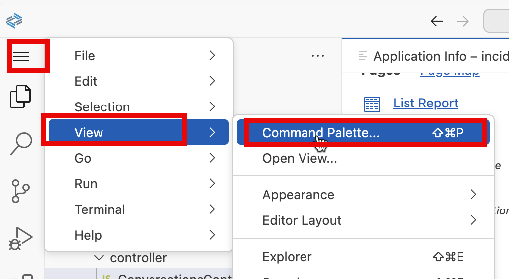
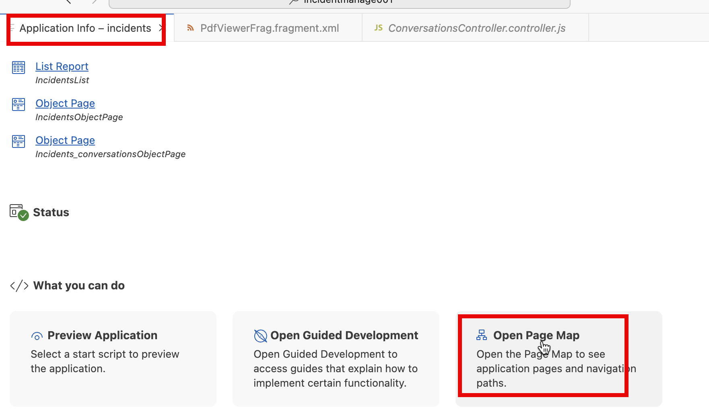
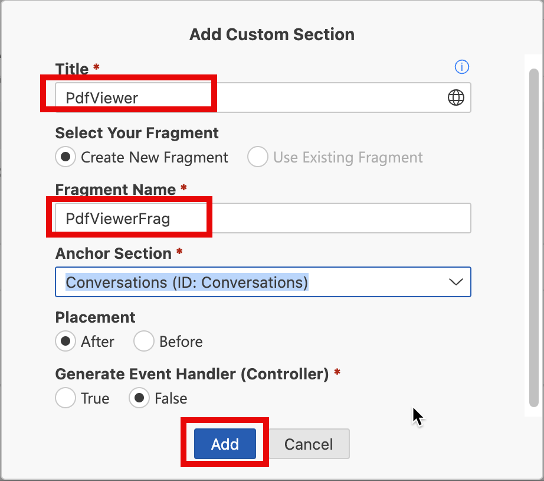

<div class="draftWatermark"></div>

<!-- # Exercise 4 - Enhance Fiori Elements with Custom Action and Fragment -->

# 练习 4 - 用自定义动作和片段增强 Fiori 元素

<!-- #### 1. Navigate to Page Map and Change the Fiori to flexible layout -->

#### 1. 导航到 `Page Map`, 将布局改成`flexible layout`


#### 2. 打开 Storyboard， 为实体**Conversations** 增加一个字段


点击 **show Details**，打开 **Properties**


增加一个新的`property`:

**Name**: `image`

**Type**: `LargeBinary`


增加`Annotation`如下:

**Annotation Target:** `Core.MediaType`

**Annotation Value: ** `application/pdf`


<!--
#### 2. 打开文件 `db/schema.cds` ，在 `Conversations` 实体下加入以下字段.

```
	image : LargeBinary
		@Core.MediaType : 'application/pdf';

```


-->

#### 3. 为实体`Conversations`增加一个`Object Page`

打开`Application Info`和 `open Page Map`

<!--  -->





增加一个新的 `Object page`


选择 **Navigation** 为 **conversations (Conversations)**
点击 **Add**


编辑这个新的页面


**Label:** `Conversations`


<!-- 
 -->


## 4, 测试上传 pdf 文件到`Conversations`实体


<!-- 
 -->


## 5, 在‘Conversations’的对象页面增加自定义`controller` .


Controller Name: `ConversationsController`


按照下面的代码调整`Controller`的代码

```js
sap.ui.define(
  [
	"sap/ui/core/mvc/ControllerExtension",
	"sap/base/security/URLWhitelist",
	"sap/ui/model/json/JSONModel",
  ],
  function (ControllerExtension, URLWhitelist, JSONModel) {
	"use strict";

	return ControllerExtension.extend(
	  "incidents.ext.controller.ConversationsController",
	  {
		// this section allows to extend lifecycle hooks or hooks provided by Fiori elements
		showPDF: async function (oEvent) {
		  var sImageUrl = oEvent
			.getModel()
			.getBindings()
			.filter((bn) => {
			  return bn.sPath == "image";
			})
			.at(0).vValue;
		  let oPdfmodel = new JSONModel({
			Source: sImageUrl,
			Title: "pdf",
			Height: "1000px",
		  });
		  URLWhitelist.add("blob");
		  this.base.getExtensionAPI()._view.setModel(oPdfmodel, "pdf");
		  this.base
			.getExtensionAPI()
			._view.getModel("pdfview")
			.setData({ Viewshow: true });

		  alert("hello hero");
		},

		override: {
		  /**
		   * Called when a controller is instantiated and its View controls (if available) are already created.
		   * Can be used to modify the View before it is displayed, to bind event handlers and do other one-time initialization.
		   * @memberOf incidents.ext.controller.ConversationsController
		   */
		  onInit: function () {
			// you can access the Fiori elements extensionAPI via this.base.getExtensionAPI
			let oPdfview = new JSONModel({
			  Viewshow: false,
			});
			this.base.getView().setModel(oPdfview, "pdfview");
			// var oModel = this.base.getExtensionAPI().getModel();
		  },
		},
	  }
	);
  }
);
```

## 6, 在`Conversations`实体的对象页面增加自定义`action`和`fragment`


Action ID: `DisplayPDF`

Button Text: `Display PDF Document`

Handler File: ConversationsController.controller (incidentmanagement004.Incidents.ext.controller.ConversationsController.controller, JS)

Handler Button: `showPDF`




Title: `PdfViewer`

Fragment Name: `PdfViewerFrag`


按照下面的代码调整自定义`Fragment`的代码.

```xml

<core:FragmentDefinition xmlns:core="sap.ui.core" xmlns="sap.m" xmlns:macros="sap.fe.macros">
	<ScrollContainer id="_IDGenScrollContainer1"
		height="100%"
		width="100%"
		horizontal="true"
		vertical="true" visible="{pdfview>/Viewshow}">
		<FlexBox id="_IDGenFlexBox1" direction="Column" renderType="Div" class="sapUiSmallMargin">
			<PDFViewer id="_IDGenPDFViewer1" source="{pdf>/Source}" isTrustedSource="true" displayType ="Embedded" title="{pdf>/Title}" height="{pdf>/Height}" >
				<layoutData>
					<FlexItemData id="_IDGenFlexItemData1" growFactor="1" />
				</layoutData>
			</PDFViewer>
		</FlexBox>
	</ScrollContainer>
</core:FragmentDefinition>

```

## 7, 测试在自定义`Fragment`显示 pdf 文件


<!-- 
 -->
<!--  -->


