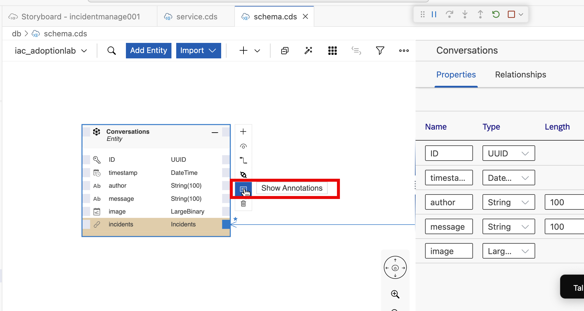
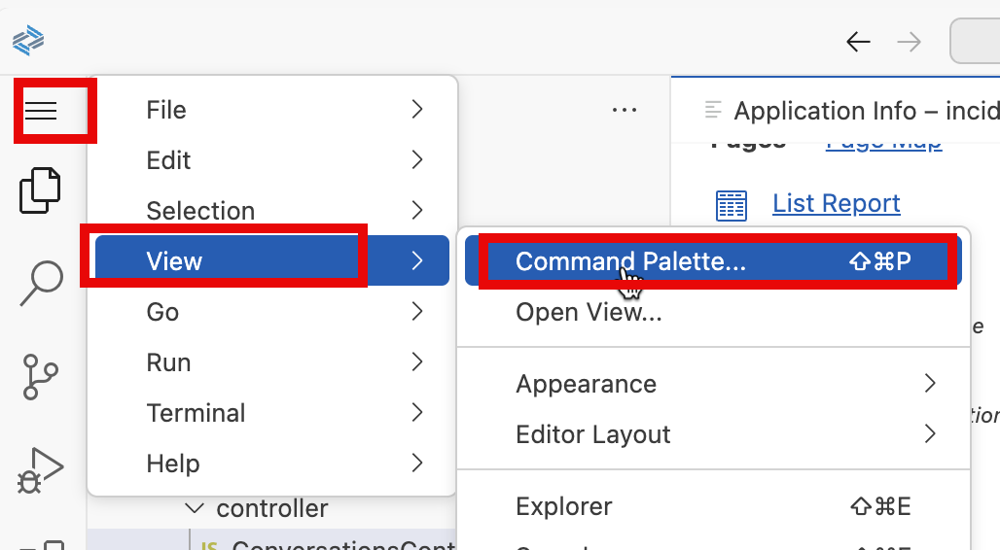
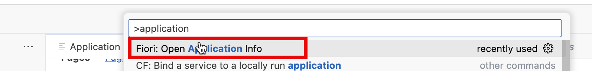
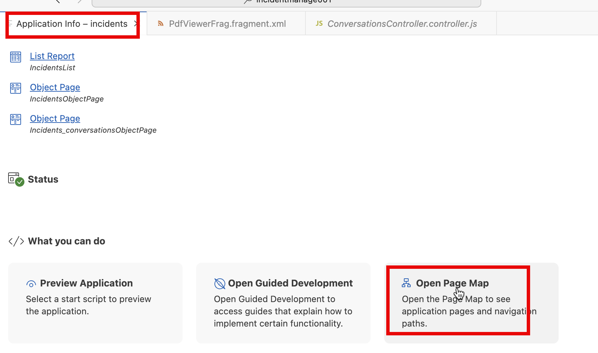
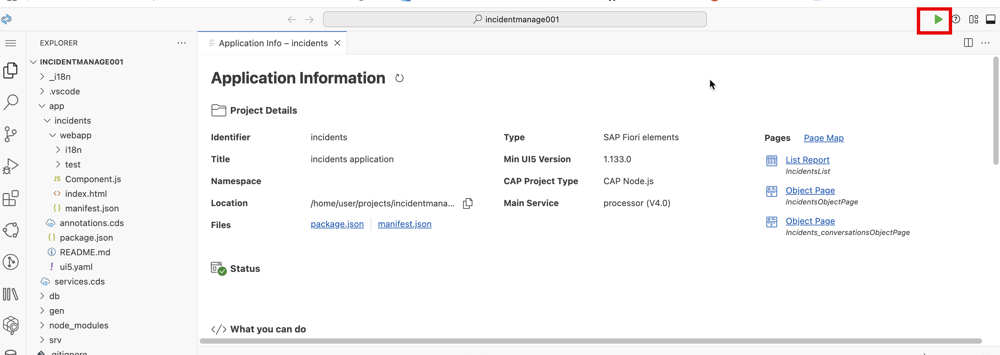
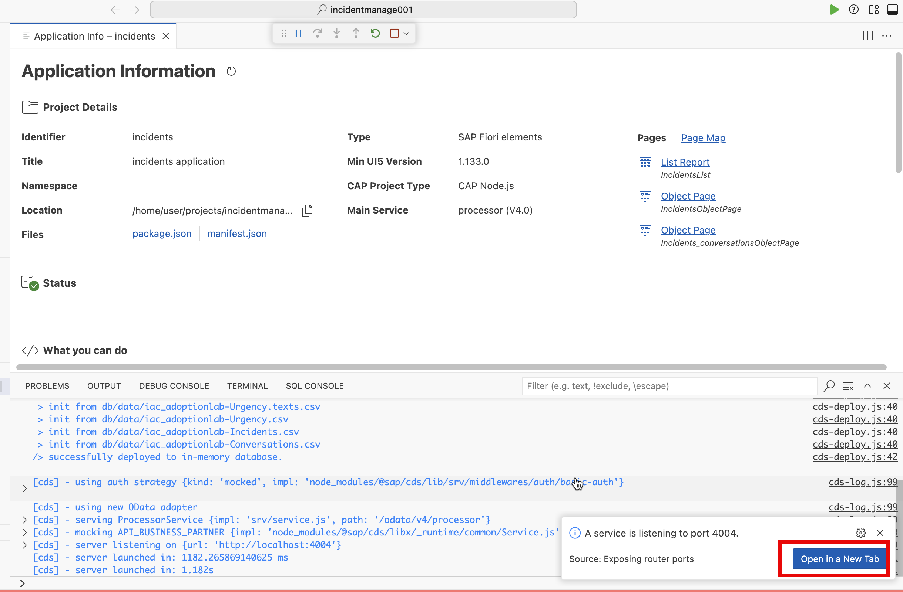
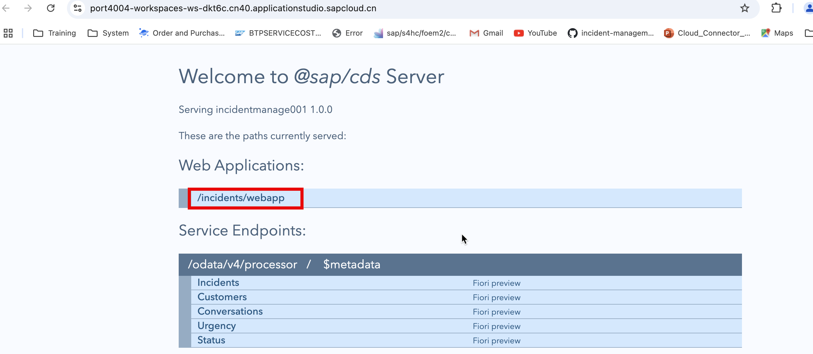
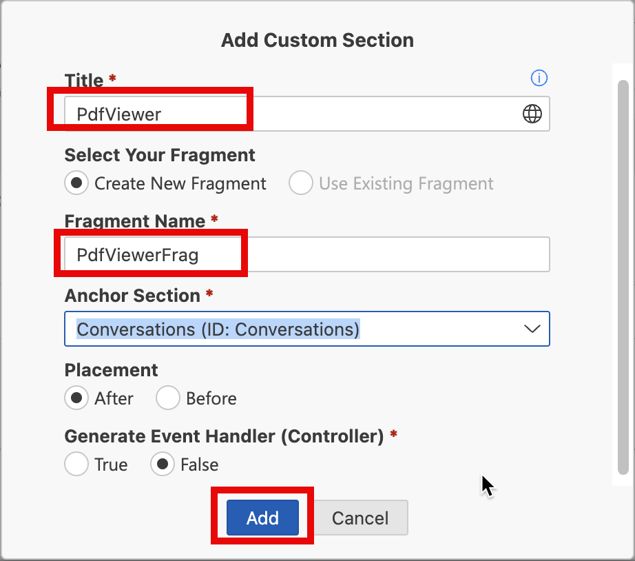

<div class="draftWatermark"></div>

<!-- # Exercise 4 - Enhance Fiori Elements with Custom Action and Fragment -->

# 练习 4 - 用自定义动作和片段增强 Fiori 元素

<!-- #### 1. Navigate to Page Map and Change the Fiori to flexible layout -->

#### 1. 导航到 `Page Map`, 将布局改成`flexible layout`


#### 2. 打开 Storyboard， 为实体**Conversations** 增加一个字段


点击 **show Details**，打开 **Properties**


增加一个新的`property`:

**Name**: `image`

**Type**: `LargeBinary`


增加`Annotation`如下:




**Annotation Target:** `Core.MediaType`

**Annotation Value:** `application/pdf`

<!--
#### 2. 打开文件 `db/schema.cds` ，在 `Conversations` 实体下加入以下字段.

```
    image : LargeBinary
        @Core.MediaType : 'application/pdf';

```


-->

#### 3. 为实体`Conversations`增加一个`Object Page`

打开`Application Info`和 `open Page Map`

<!--  -->





增加一个新的 `Object page`


选择 **Navigation** 为 **conversations (Conversations)**
点击 **Add**


编辑这个新的页面


**Label:** `Conversations`


<!-- 
 -->


## 4, 测试上传 pdf 文件到`Conversations`实体





<!-- 
 -->


## 5, 在‘Conversations’的对象页面增加自定义`controller` .


Controller Name: `ConversationsController`


按照下面的代码调整`Controller`的代码

```js
sap.ui.define(
  [
    "sap/ui/core/mvc/ControllerExtension",
    "sap/base/security/URLWhitelist",
    "sap/ui/model/json/JSONModel",
  ],
  function (ControllerExtension, URLWhitelist, JSONModel) {
    "use strict";

    return ControllerExtension.extend(
      "incidents.ext.controller.ConversationsController",
      {
        // this section allows to extend lifecycle hooks or hooks provided by Fiori elements
        showPDF: async function (oEvent) {
          var sImageUrl = oEvent
            .getModel()
            .getBindings()
            .filter((bn) => {
              return bn.sPath == "image";
            })
            .at(0).vValue;
          let oPdfmodel = new JSONModel({
            Source: sImageUrl,
            Title: "pdf",
            Height: "1000px",
          });
          URLWhitelist.add("blob");
          this.base.getExtensionAPI()._view.setModel(oPdfmodel, "pdf");
          this.base
            .getExtensionAPI()
            ._view.getModel("pdfview")
            .setData({ Viewshow: true });

          alert("hello hero");
        },

        override: {
          /**
           * Called when a controller is instantiated and its View controls (if available) are already created.
           * Can be used to modify the View before it is displayed, to bind event handlers and do other one-time initialization.
           * @memberOf incidents.ext.controller.ConversationsController
           */
          onInit: function () {
            // you can access the Fiori elements extensionAPI via this.base.getExtensionAPI
            let oPdfview = new JSONModel({
              Viewshow: false,
            });
            this.base.getView().setModel(oPdfview, "pdfview");
            // var oModel = this.base.getExtensionAPI().getModel();
          },
        },
      }
    );
  }
);
```

## 6, 在`Conversations`实体的对象页面增加自定义`action`和`fragment`


Action ID: `DisplayPDF`

Button Text: `Display PDF Document`

Handler File: ConversationsController.controller (incidentmanagement004.Incidents.ext.controller.ConversationsController.controller, JS)

Handler Button: `showPDF`




Title: `PdfViewer`

Fragment Name: `PdfViewerFrag`


按照下面的代码调整自定义`Fragment`的代码.

```xml

<core:FragmentDefinition xmlns:core="sap.ui.core" xmlns="sap.m" xmlns:macros="sap.fe.macros">
	<ScrollContainer id="_IDGenScrollContainer1"
		height="100%"
		width="100%"
		horizontal="true"
		vertical="true" visible="{pdfview>/Viewshow}">
		<FlexBox id="_IDGenFlexBox1" direction="Column" renderType="Div" class="sapUiSmallMargin">
			<PDFViewer id="_IDGenPDFViewer1" source="{pdf>/Source}" isTrustedSource="true" displayType ="Embedded" title="{pdf>/Title}" height="{pdf>/Height}" >
				<layoutData>
					<FlexItemData id="_IDGenFlexItemData1" growFactor="1" />
				</layoutData>
			</PDFViewer>
		</FlexBox>
	</ScrollContainer>
</core:FragmentDefinition>

```

## 7, 测试在自定义`Fragment`显示 pdf 文件


<!-- 
 -->
<!--  -->


