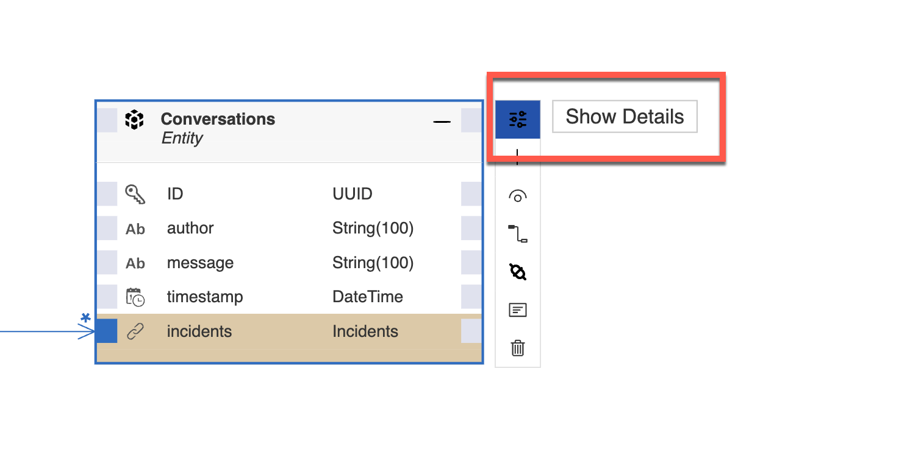
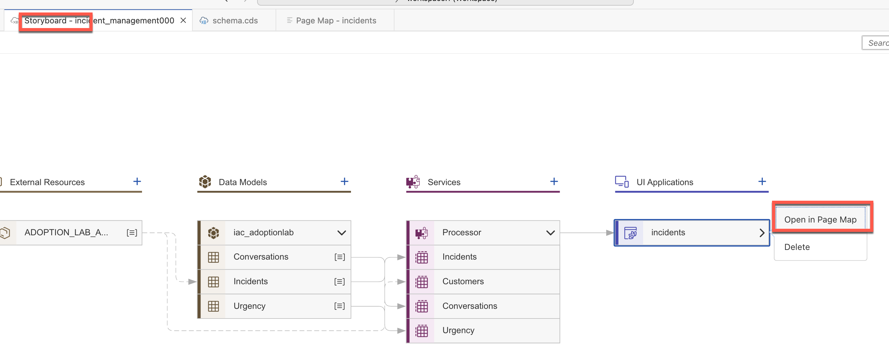
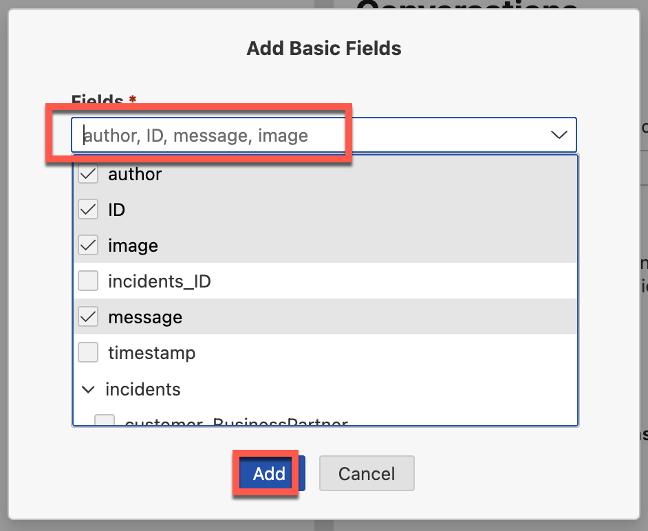

<div class="draftWatermark"></div>

# 练习4 - 使用自定义操作和片段增强Fiori Elements

#### 1. 导航到页面映射并更改fiori为灵活布局


#### 2. 打开故事板并为实体**Conversations**添加字段


点击**Show Details**并打开**Properties**标签页


添加新属性：
**Name**: image
**Type**: LargeBinary


打开注解编辑页面


添加注解如下：
**Annotation目标:** Core.MediaType
**Annotation值:** application/pdf


#### 2. 为实体Conversations添加对象页面

返回故事板并打开PageMap


添加新的对象页面


选择**Navigation**为 **conversations (Conversations)**
点击**Add**


编辑新的页面


添加一个 Form Section


将Label设置成 **Conversations**

在 Form 中添加 Basic Fields


添加以下 Fields: **author**, **ID**, **image**, **message**



## 3. 测试上传PDF文档到Conversations实体。


上传 PDF 文件进行测试


## 4. 在Conversations实体的对象页面中添加自定义控制器。
添加 Controller Extension，命名为：**ConversationsController**


编辑刚刚创建的Controller


调整控制器代码如下：

```
sap.ui.define(['sap/ui/core/mvc/ControllerExtension','sap/base/security/URLWhitelist' ,'sap/ui/model/json/JSONModel'], function (ControllerExtension,URLWhitelist,JSONModel) {
	'use strict';

	return ControllerExtension.extend('incidentmanagement004.Incidents.ext.controller.ConversationsController', {
		// 这部分允许扩展Fiori元素提供的生命周期挂钩或挂钩
		
		showPDF:async function(oEvent){
			var sImageUrl = oEvent.getModel().getBindings().filter( bn=>{ return bn.sPath=='image' }).at(0).vValue;
			let oPdfmodel = new JSONModel({
				Source: sImageUrl,
				Title: 'pdf',
				Height: "1000px"
			});
			URLWhitelist.add("blob");
			this.base.getExtensionAPI()._view.setModel(oPdfmodel,"pdf");
			this.base.getExtensionAPI()._view.getModel('pdfview').setData({"Viewshow":true});

			alert('hello hero');
		},
		
		
		override: {
			/**
             * 当控制器实例化且其视图控件（如有）已创建时调用。
             * 可以在此处修改视图，绑定事件处理程序并进行其他一次性初始化。
             * @memberOf incidentmanagement004.Incidents.ext.controller.ConversationsController
             */


			onInit: function () {
				// var oModel = this.base.getExtensionAPI().getModel();
				let oPdfview = new JSONModel({
					Viewshow: false
				});
				this.base.getView().setModel(oPdfview,"pdfview");
			}
		}
	});
});

```


## 5. 在Conversations实体的对象页面中添加自定义操作和片段。


**操作ID**: DisplayPDF
**按钮文本**: 显示PDF文档
**处理程序文件**: ConversationsController.controller (incidentmanagement004.Incidents.ext.controller.ConversationsController.controller, JS)
**处理程序按钮**: showPDF


添加一个 Custom Section 进行PDF预览


**标题**: PdfViewer
**片段名**: PdfViewerFrag


编辑前端页面UI


```

<core:FragmentDefinition xmlns:core="sap.ui.core" xmlns="sap.m" xmlns:macros="sap.fe.macros">
    <ScrollContainer id="_IDGenScrollContainer1"
        height="100%"
        width="100%"
        horizontal="true"
        vertical="true" visible="{pdfview>/Viewshow}">
        <FlexBox id="_IDGenFlexBox1" direction="Column" renderType="Div" class="sapUiSmallMargin">
            <PDFViewer id="_IDGenPDFViewer1" source="{pdf>/Source}" isTrustedSource="true" displayType ="Embedded" title="{pdf>/Title}" height="{pdf>/Height}">
                <layoutData>
                    <FlexItemData id="_IDGenFlexItemData1" growFactor="1" />
                </layoutData>
            </PDFViewer>
        </FlexBox>
    </ScrollContainer>
</core:FragmentDefinition>

```


## 6. 测试在自定义片段中查看PDF文档


打开应用页面


