<div class="draftWatermark"></div>

# 练习 5 - 在应用程序中添加单元测试
---

在本练习中，我们将为自动紧急程度确定增加一个单元测试。该单元测试会检查根据事件标题是否将紧急程度提升到 **高**。

## 创建针对基于事件标题更新紧急程度的测试

##### 测试会用到第三方的工具，下面我们进行相关的配置设置

1. 在 **package.json** 文件下的 **devDependencies** 里添加测试相关的依赖

```
    "@cap-js/cds-test": "^0.2.0",
    "chai": "^4.4.1",
    "chai-as-promised": "^7.1.2",
    "chai-shallow-deep-equal": "^1.4.6",
    "chai-subset": "^1.6.0",
    "jest": "^29.7.0",
    "jest-junit": "^16.0.0",
    "jest-sonar-reporter": "^2.0.0",
    
```

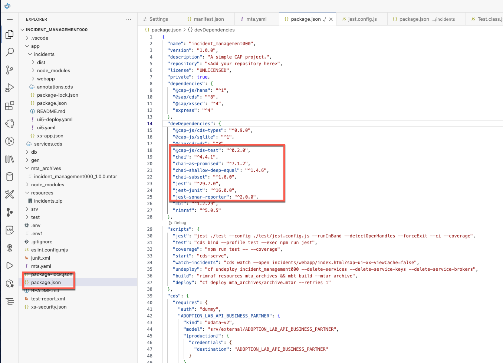

2. 在 scripts 部分添加如下配置

```
"jest": "jest ./test --config ./test/jest.config.js --runInBand --detectOpenHandles --forceExit --ci --coverage",
"test": "cds bind --profile test --exec npm run jest",
```
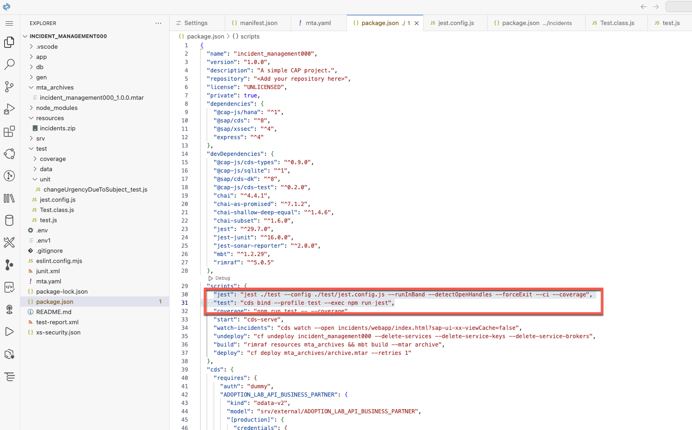


2. 在 test 文件夹下创建3个文件：**jest.config.js**，**Test.class.js**，**test.js**

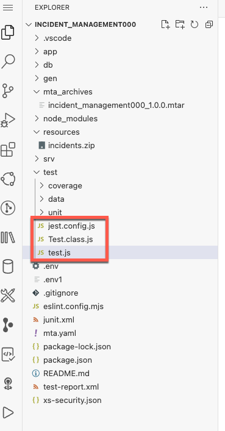


3. 在**jest.config.js**内添加如下内容

```
const config = {
    testTimeout: 1000000,
    testEnvironment: "node",
    // Automatically clear mock calls, instances, contexts and results before every test
    clearMocks: true,

    // Indicates whether the coverage information should be collected while executing the test
    collectCoverage: true,

    // An array of glob patterns indicating a set of files for which coverage information should be collected
    // collectCoverageFrom: undefined,

    // The directory where Jest should output its coverage files
    coverageDirectory: "./coverage",
    reporters: ["default", "jest-junit"],
    testResultsProcessor: "jest-sonar-reporter"
};

module.exports = config;
```
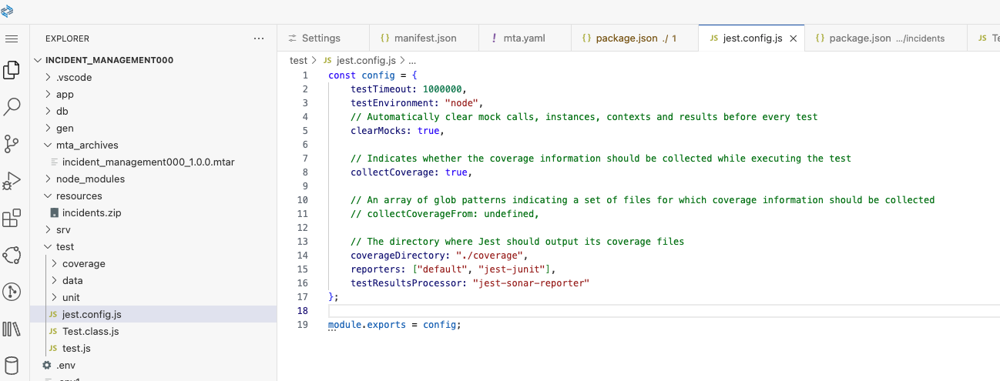


4. 在**Test.class.js**内添加如下代码

```
"use strict";

module.exports = class Test {
  constructor(GET, POST, PATCH, DELETE, test, expect, axios, cds) {
    this.cds = cds;
    this.POST = POST;
    this.PATCH = PATCH;
    this.DELETE = DELETE;
    this.test = test;
    this.expect = expect;
    this.axios = axios;
    this.cds = cds;
    this.GET = GET;
  }
};
```

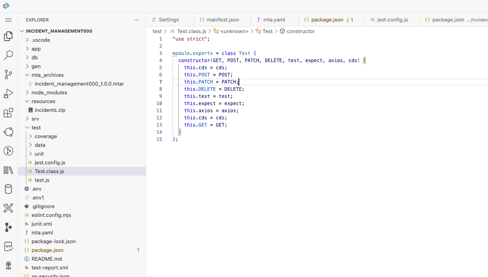

5. 在**test.js**内添加如下内容

```
"use strict";

// require dependencies
const chai = require('chai');
chai.use(require('chai-shallow-deep-equal'));

const IncidentService = require('../test/unit/changeUrgencyDueToSubject_test');

// launch cds server
const cds = require('@sap/cds/lib');
const TestClass = require('./Test.class');
if (cds.User.default) cds.User.default = cds.User.Privileged; // hardcode monkey patch
else cds.User = cds.User.Privileged;
const { GET, POST, PATCH, DELETE, test, expect, axios} = cds.test('serve', __dirname + '/../srv','--in-memory');

// run tests
const oTest = new TestClass(GET, POST, PATCH, DELETE, test, expect, axios, cds);
IncidentService.test(oTest);
```

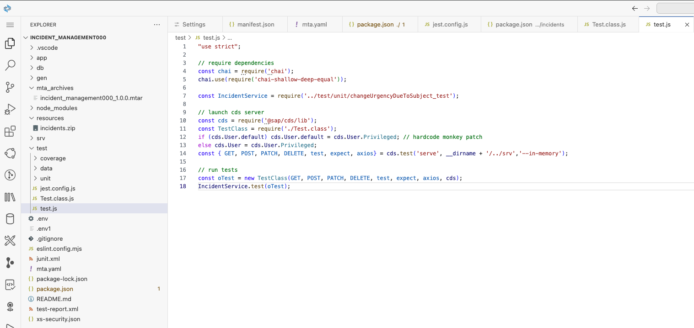

#### 接下来，开始准备测试用例

1. 先在 **test** 文件夹下创建一个 **unit** 文件夹

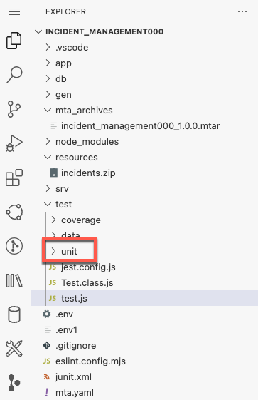

2. 在 **unit** 下创建一个测试文件 **changeUrgencyDueToSubject_test.js**
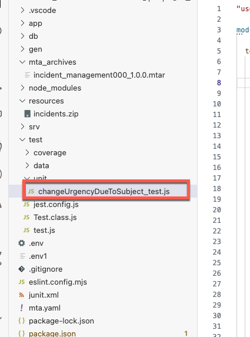

3. 添加测试代码到文件中

```
"use strict";

module.exports = {

  test: function (oTestClass) {
    describe('my test suite', () => {

      const { GET, POST, DELETE, test, expect } = oTestClass;
      beforeAll(async () => {});
      beforeEach(async () => {
        await test.data.reset();
      });

      it('should test', async () => {   // Jest & Mocha
        

        let draftId, incidentId;

        // Create an incident 
        const createIncident = await POST(`/service/Processor/Incidents`, {
          title: 'Urgent attention required!',
        });

        draftId = createIncident.data.ID;
        expect(createIncident.status).to.equal(201);
        expect(createIncident.statusText).to.equal('Created');

        const responseActivate = await POST(
          `/service/Processor/Incidents(ID=${draftId},IsActiveEntity=false)/Processor.draftActivate`
        );
        expect(responseActivate.status).to.eql(201);
        incidentId = responseActivate.data.ID;
        // Test the Urgency
        expect(responseActivate.data.urgency_code).to.eql('H');

        const getIncident = await GET(`/service/Processor/Incidents(ID=${incidentId},IsActiveEntity=true)`);

        expect(getIncident.status).to.eql(200);
        expect(getIncident.data.urgency_code).to.eql('H');

        // Clean up 
        const responseDelete = await DELETE(`/service/Processor/Incidents(ID=${incidentId},IsActiveEntity=true)`);
        expect(responseDelete.status).to.eql(204);

      });

    })
  }
};
```
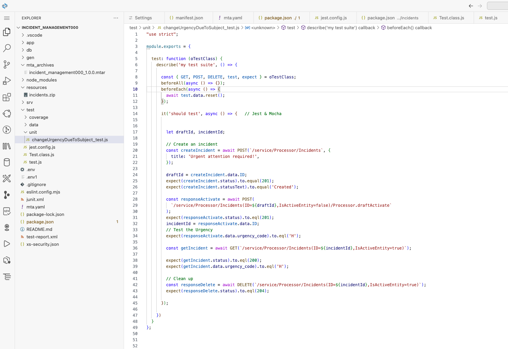

#### 接下来我们打开命令行面板运行测试

1. 运行命令`npm test`

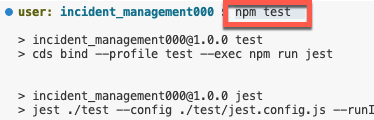

2. 可以获得测试结果如下

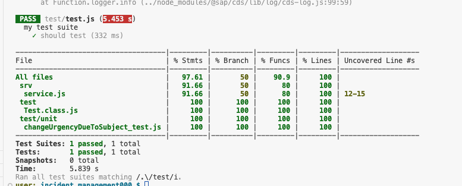


## 总结
我们现在为应用程序添加了一个单元测试。

