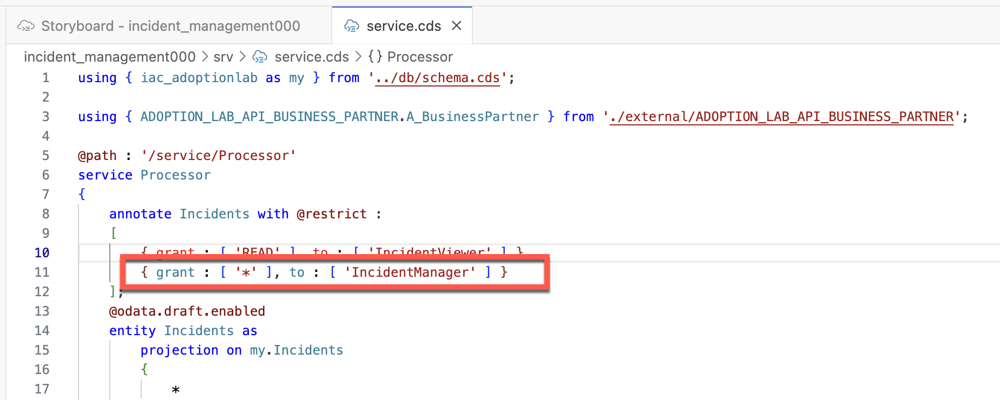

<div class="draftWatermark"></div>

# 实践任务6 - 实现角色和权限检查

---

本任务将向你展示如何为CAP应用程序启用身份验证和授权。

你需要学习以下内容：
* 如何将角色限制添加到实体中
* 如何为测试添加本地用户 
* 如何使用用户名和密码访问应用程序

## 在CAP实体中添加角色限制

1. 选择**service.cds**, 打开编辑器

针对实体 **Incidents**，添加一个名为**IncidentViewer**的角色，并将其权限设置为**Read**

```
annotate Incidents with @restrict :
    [
        { grant : [ 'READ' ], to : [ 'IncidentViewer' ] }
    ];
```


2. 添加另一个名为**IncidentManager**的角色，并将其权限设置为**Full**

```
{ grant : [ '*' ], to : [ 'IncidentManager' ] }
```




4. 接下来，可以将角色分配给服务。

选择角色**IncidentViewer**和**IncidentManager**，并将其分配给服务 **Processor**

```
annotate Processor with @requires :
[
    'authenticated-user',
    'IncidentViewer',
    'IncidentManager'
];
```


重复以上步骤，给实体**Customers**，**Conversations**，**Urgency** 分配 **IncidentViewer**，**IncidentManager**角色权限

```
    annotate Customers with @restrict :
    [
        { grant : [ 'READ' ], to : [ 'IncidentViewer' ] },
        { grant : [ '*' ], to : [ 'IncidentManager' ] }
    ];

    annotate Conversations with @restrict :
    [
        { grant : [ 'READ' ], to : [ 'IncidentViewer' ] },
        { grant : [ '*' ], to : [ 'IncidentManager' ] }
    ];

    annotate Urgency with @restrict :
    [
        { grant : [ 'READ' ], to : [ 'IncidentViewer' ] },
        { grant : [ '*' ], to : [ 'IncidentManager' ] }
    ];
```


5. 检查**xs-security.json**文件的内容。

你已经在CDS服务模型中使用require注解添加了授权。


在终端运行以下命令：

`cds add xsuaa --for production`

> 运行cds add xsuaa做了两件事：
>
> 将SAP授权和信任管理服务添加到**package.json**文件中的INCIDENT-MANAGEMENT项目中。
> 创建SAP授权和信任管理服务的安全配置（即xs-security.json文件）供INCIDENT-MANAGEMENT项目使用。


这是现在转换为SAP授权和信任管理服务的范围和角色模板。因此，在**xs-security.json**文件中为支持角色创建了一个范围和角色模板：（将**XXX**替换为你自己的ID）
```

{
  "scopes": [
    {
      "name": "$XSAPPNAME.IncidentViewer",
      "description": "IncidentViewer"
    },
    {
      "name": "$XSAPPNAME.IncidentManager",
      "description": "IncidentManager"
    }
  ],
  "attributes": [],
  "role-templates": [
    {
      "name": "IncidentViewer",
      "description": "generated",
      "scope-references": [
        "$XSAPPNAME.IncidentViewer"
      ],
      "attribute-references": []
    },
    {
      "name": "IncidentManager",
      "description": "generated",
      "scope-references": [
        "$XSAPPNAME.IncidentManager"
      ],
      "attribute-references": []
    }
  ],
  "xsappname": "incident_managementXXX",
  "tenant-mode": "dedicated"
}
```

6. 重新部署应用程序并检查新角色。


部署后，你可以在子账户的Roles页面下查找新创建的角色。


当你尝试访问应用程序时，会出现一个**Forbidden**的错误信息。


7. 分配新角色并检查访问控制。


首先，创建一个名为**Incident Viewer**的角色集合，并添加角色**IncidentViewer**至其中。

将该角色集合分配给自己。


你将有权搜索记录，但不能编辑。

 

让我们创建一个新的名为**Incident Manager**的角色集合，并将角色**IncidentManager**绑定到其中。

将其分配给自己，检查应用程序访问权限。 


现在你可以搜索和编辑记录。


## 为本地测试添加用户

你所添加到CAP模型中的权限检查不仅在云部署时会应用，在本地测试中也会应用。因此，你需要一种方式能够以本地的方式登录应用程序。

CAP提供了一种可能性，在cds配置中为测试添加本地用户。在此教程中，你使用package.json文件中的开发配置来添加用户。

1. 在你的项目目录中打开package.json文件。

在package.json文件中，添加以下代码：

```

"auth": {
        "[development]": {
          "kind": "mocked",
          "users":{
            "alice": {
              "password": "initial",
              "roles": ["IncidentViewer"]
            },
            "bob": {
              "password": "initial",
              "roles": ["IncidentManager"]
            }
          }
        },
        "[production]": {
          "kind": "xsuaa"
        }
      },


```


每个用户条目都是用户的对象的一部分。键是用户的ID，它们可以有不同的属性。对于此场景你定义一个密码以及角色的数组。

你添加了两个用户：

* **alice**，具有**IncidentViewer**角色和初始密码
* **bob**，具有**IncidentManager**角色和初始密码

> 请注意，CAP的角色与Cloud Foundry的角色和范围并不是同一回事。请参阅文档中的认证部分。

2. 设置**身份验证**为**Mocked**在运行配置中

点击**Run**图标 


点击Incidents图标以打开应用程序。


它将弹出登录对话框，输入**alice**凭据。


尝试编辑记录，它将弹出“被禁止”的错误信息。


注销后，切换到**bob**凭据检查权限。


现在你可以编辑记录并拥有完整的权限。


**恭喜你！**
你现在对CAP应用程序中的认证和授权有了更好的理解。