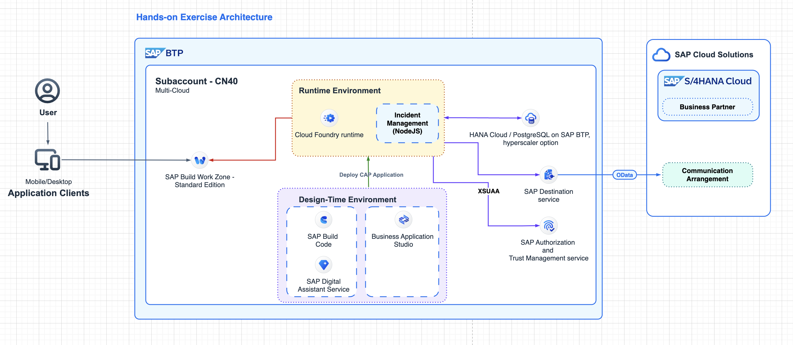

<h1 style="text-align: center;color:blue;font-weight:bold;">「SAP 用户成功日」—— SAP BTP [业务技术云平台] 专场 #</h1>
<h3 style="text-align: center;"> 借助 SAP BTP CAP 加速 Clean Core 扩展开发 </h3>

---

## 描述

本次研讨会旨在为参与者提供全面的学习体验，以帮助他们掌握有效利用SAP云应用编程（CAP）所需的实用技能和知识。

在研讨会上，我们将让参与者尝试各种开发功能以获得实践经验，并讨论CAP CDS、授权、HANA云和Fiori元素以及扩展S/4HANA云。

通过一系列练习，您将了解如何使用 SAP Business Application Studio / SAP Build Code开发人员助手创建数据实体和后端逻辑。

本次研讨会专为应用开发人员设计，旨在提高其扩展开发能力，并贡献于组织内的解决方案改进。

## 概述

### 练习概述
在本节中，您将学习如何使用SAP Build Code 或 SAP Business Application Studio在SAP Business Technology Platform（BTP）上快速开发应用。您将学习如何几分钟内构建一个完整功能的CRUD（创建、读取、更新和删除）应用，包括后端服务和UI应用，只需使用可视化编辑器。您将连接应用到SAP S/4HANA API，学习如何轻松切换至代码并在此基础上创建额外的业务逻辑以最终在BTP上一键部署应用。

### 用例

在本次采用实验室中，我们将创建一个事件管理应用。为此，我们需要使用Cloud Application Programming Model（CAP）创建新的后端服务，并基于Fiori元素开发一个网络应用，用户可以通过此应用管理事件。

## 要求

用户自备 BTP 环境（租用如下服务：Cloud Foundry Runtime, SAP Business Application Studio 或 SAP Build Code, SAP HANA Cloud 或 PostgreSQL on SAP BTP – hyperscaler option, SAP Build Work Zone - standard edition）

* **【默认】动手练习需要在贵公司的 BTP 开发环境进行**
* *【可选】申请 [SAP BTP 试用环境](https://www.sap.cn/products/technology-platform/trial.html)*

## 如何获得支持

* 在Zoom聊天中提问或解除静音直接询问问题。
* 如果需要远程检查，请使用Zoom举手功能并分享屏幕以解释症状。

---

**SAP Build Code 动手练习（英文）**: https://robin-qiu.github.io/BTP-CAP-Development-with-SAP-Build-Code---Bring-Your-Own-Tenant/#/