<div class="draftWatermark"></div>

# 练习2 - 引用SAP S/4HANA Cloud服务到数据模型中

---

在本练习中，我们将添加SAP S/4HANA Cloud服务Business Partner到项目，并将其关联至我们的事件管理模型。

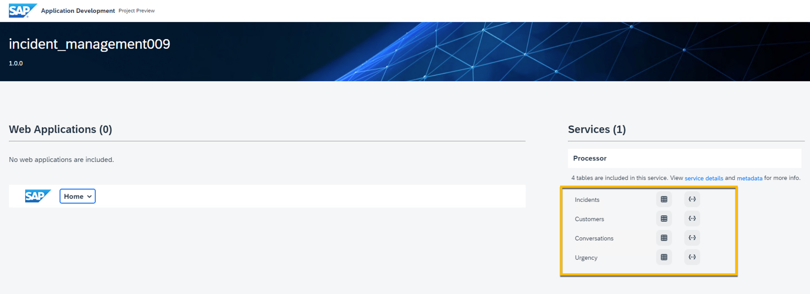

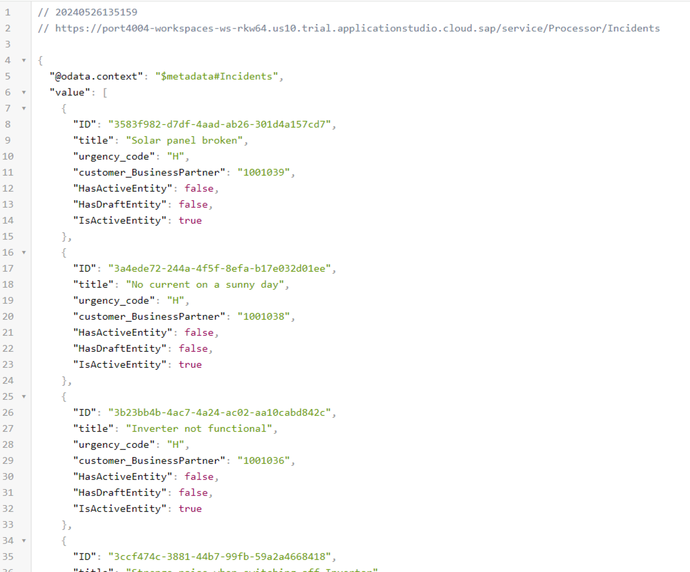

##### 发现并添加SAP S/4HANA Cloud服务到数据模型中

从**Storyboard**标签页，点击外部资源图标上的"+"按钮。这将打开左侧的“服务中心”。

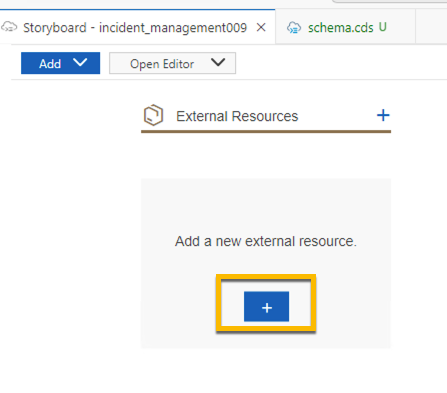

在“服务中心”中，你可以看到"SAP系统"节点。技术上来说，它包含了管理员为你在后端系统中设置的OData服务的目的地。这些服务可以来自SAP S/4HANA系统或者其他SAP后端系统。

展开**SAP System > lcapteched**, 并选择 **ADOPTION_LAB_API_BUSINESS_PARTNER**。

现在你可以看到所选服务的详细信息，包括实体、每个实体的属性以及关于服务的一般数据。

点击屏幕右上角的“添加外部数据模型”。

这将把所选服务添加到你的项目中。

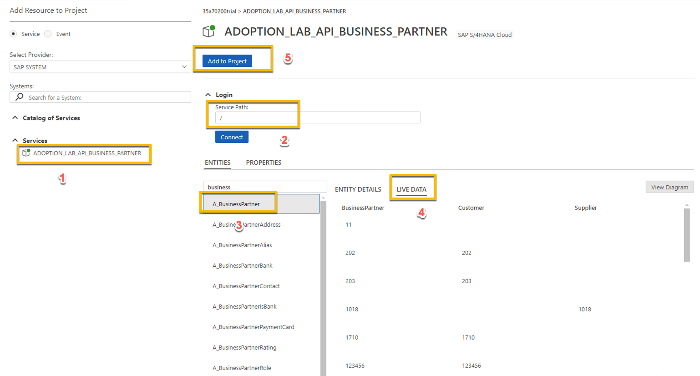

返回到**Storyboard**标签页。几秒钟后，新的服务将在“外部资源”图标中显示。

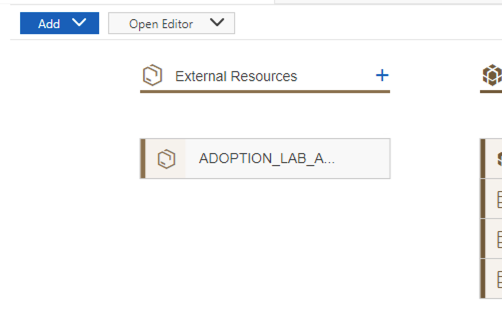

##### 将业务伙伴实体关联至事件管理实体

从**Storyboard**, 在数据模型下选择一个实体，并点击“以图形建模器打开”以便回到图形化编辑界面。

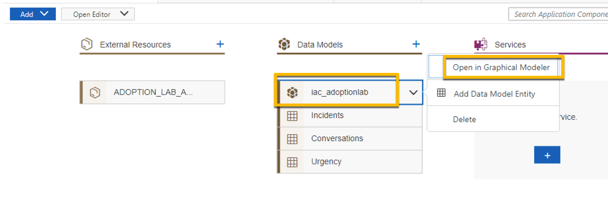

从“事件”实体中，点击添加关系图标。
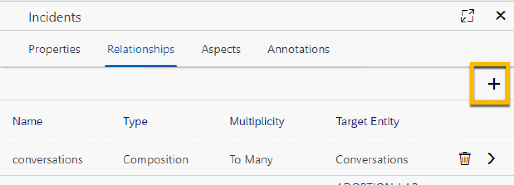

这将创建一个新的关联至业务伙伴实体。然而，在画布上你并没有看到业务伙伴实体，这是因为它的命名空间不同于我们的事件实体。

新的对话框出现。
1. 从目标实体下拉列表中选择**API_BUSINESS_PARTNER-A_BusinessPartner**。
2. 将建议的属性名称改为**customer**。
3. 确保所有其他建议（Association和To-One）不变，并点击“创建”。

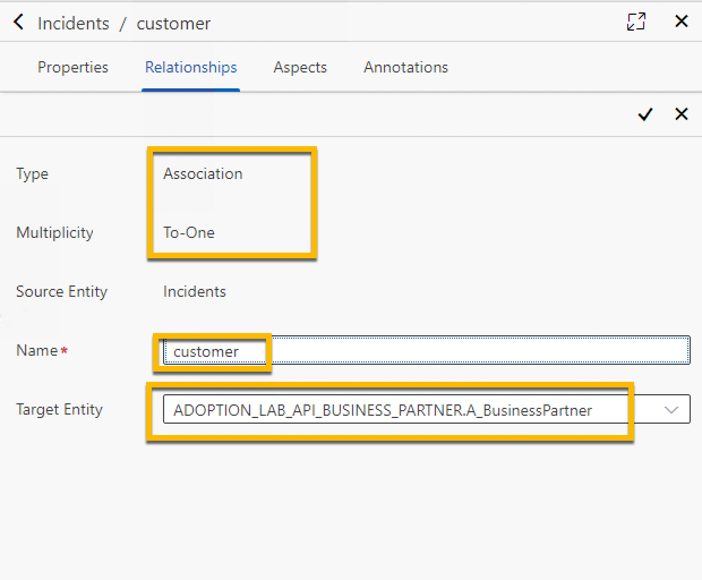

此时，你可以看到最后的数据模型：
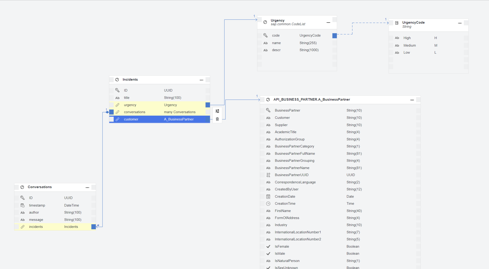

## 总结

你现在已经添加了一个对外部的引用到你的SAP S/4HANA Cloud后端系统，并将其连接至你的“事件管理”数据模型。

---

### 添加示例数据

我们现在将使用一些示例数据填充我们的数据模型以便测试我们的服务。请注意，尽管名为示例数据，其实它有两种类型：
- 固定值，是应用程序的一部分，并应该在部署时一同部署。示例：如果没有固定的一套紧急程度，则使用固定的值。
- 示例数据，仅用于测试你创建的服务和应用程序，并不应包含在生产部署中。

回到**Storyboard**, 并选择数据模型标签中的“事件”实体，点击“添加示例数据”。

示例数据编辑器打开。
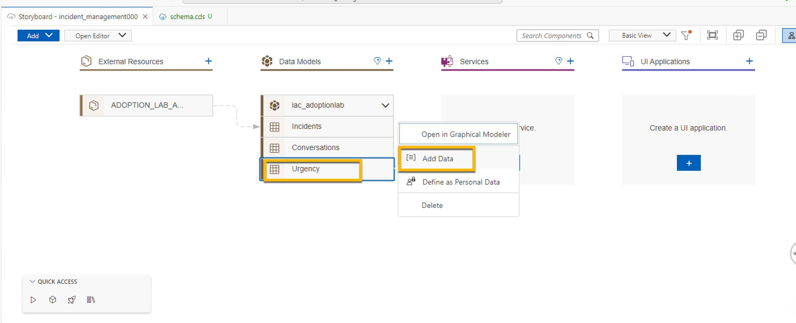

点击“添加”。保持“名称”字段为空。
在“descr”字段中，分别为每一行输入Low, Medium和High。

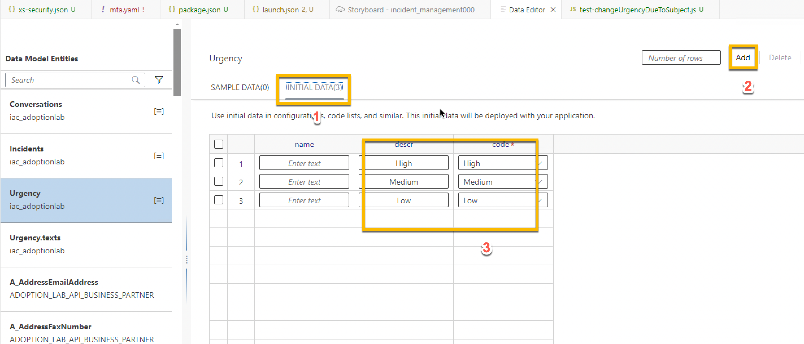

现在我们将从一个文件导入数据至**A_BusinessPartner**实体。

下载[Customers](https://robin-qiu.github.io/BTP-CAP-Development-with-SAP-Build-Code---Bring-Your-Own-Tenant/vx_attachments/477573873607615/customers.csv)文件，并点击下载图标。
或使用本地文本编辑器，创建一个名为`customers.csv`的本地文件。
将以下内容添加到文件中并保存：
```
BusinessPartner,FirstName,LastName
1001036,Daniel,Watts
1001038,Stormy,Weathers
1001039,Sunny,Sunshine
```

从编辑器中选择**A_BusinessPartner**，并点击“导入”。

在打开的文件选择对话框中，选择你创建的'customers.csv'文件。
数据被添加。

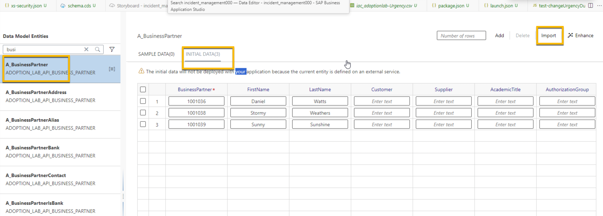

现在我们将从文件导入数据至**Incidents**实体。

下载[Incidents](https://robin-qiu.github.io/BTP-CAP-Development-with-SAP-Build-Code---Bring-Your-Own-Tenant/vx_attachments/477573873607615/incidents.csv)文件，并点击下载图标。

或使用本地文本编辑器，创建一个名为`incidents.csv`的本地文件。
将以下内容添加到文件中并保存：
```
ID,title,urgency_code,customer_BusinessPartner
3b23bb4b-4ac7-4a24-ac02-aa10cabd842c,Inverter not functional,H,1001036
3a4ede72-244a-4f5f-8efa-b17e032d01ee,No current on a sunny day,H,1001038
3ccf474c-3881-44b7-99fb-59a2a4668418,Strange noise when switching off Inverter,M,1001039
3583f982-d7df-4aad-ab26-301d4a157cd7,Solar panel broken,H,1001039
```

从编辑器中选择**Incidents**，并点击“导入”。

在打开的文件选择对话框中，选择你创建的'incidents.csv'文件。
数据被添加。

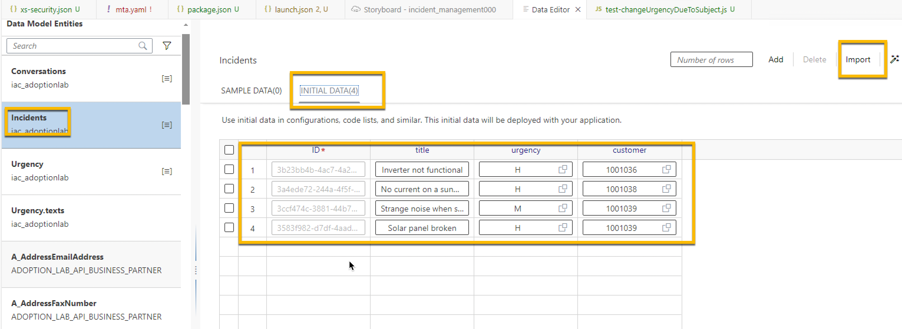

最后一步，我们将从文件导入数据至**Conversations**实体。

下载[Conversations](https://robin-qiu.github.io/BTP-CAP-Development-with-SAP-Build-Code---Bring-Your-Own-Tenant/vx_attachments/477573873607615/conversations.csv)文件，并点击下载图标。

或使用本地文本编辑器，创建一个名为`conversations.csv`的本地文件。
将以下内容添加到文件中并保存：
```
ID,incidents_ID,timestamp,author,message
2b23bb4b-4ac7-4a24-ac02-aa10cabd842c,3b23bb4b-4ac7-4a24-ac02-aa10cabd842c,1995-12-17T03:24:00Z,Harry John,Can you please check if battery connections are fine?
2b23bb4b-4ac7-4a24-ac02-aa10cabd843c,3a4ede72-244a-4f5f-8efa-b17e032d01ee,1995-12-18T04:24:00Z,Emily Elizabeth,Can you please check if there are any loose connections?
9583f982-d7df-4aad-ab26-301d4a157cd7,3583f982-d7df-4aad-ab26-301d4a157cd7,2022-09-04T12:00:00Z,Sunny Sunshine, please check why the solar panel is broken
9583f982-d7df-4aad-ab26-301d4a158cd7,3ccf474c-3881-44b7-99fb-59a2a4668418,2022-09-04T13:00:00Z,Bradley Flowers,What exactly is wrong?
```

从编辑器中选择**Conversations**，并点击“导入”。

在打开的文件选择对话框中，选择你创建的'conversations.csv'文件。
数据被添加。

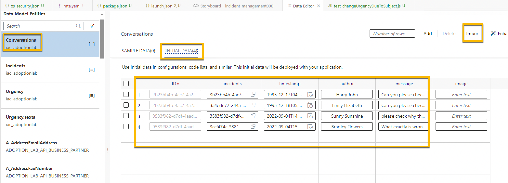

## 总结

我们现在将一些示例数据添加到了两个数据模型中，以便我们在之后测试我们将要创建的服务时使用。

---

### 创建服务(API)

在数据模型(持久层)创建之后，我们现在将选择对外暴露的功能作为API。这个API可以被UI应用程序、工作流等消费。为此，我们将多个实体添加到服务中。CAP将自动通过OData服务暴露该服务。

##### 创建新的服务实体

我们将添加4个实体至服务中：Customers（客户）、Incidents（事件）、Conversations（对话）以及Urgency（紧急程度）。

回到SAP Business Application Studio中的**Storyboard标签页。**

在Storyboard中，从服务图标上点击“+”按钮，并输入服务名称为**Processor**。
CDS图形建模器打开。

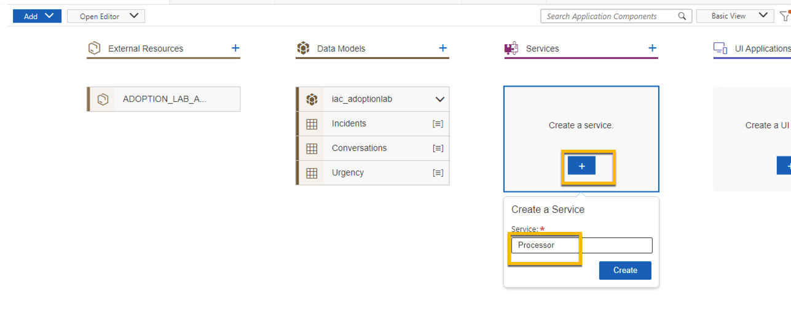

从工具栏中点击“添加实体”并选择“Entity1”。

**新投影对话框打开**

从工具栏中点击“添加实体”并选择“Entity1”。

**新投影对话框打开**

选择teched.Incidents实体，确保勾选“启用草稿编辑”复选框，并点击“确定”。

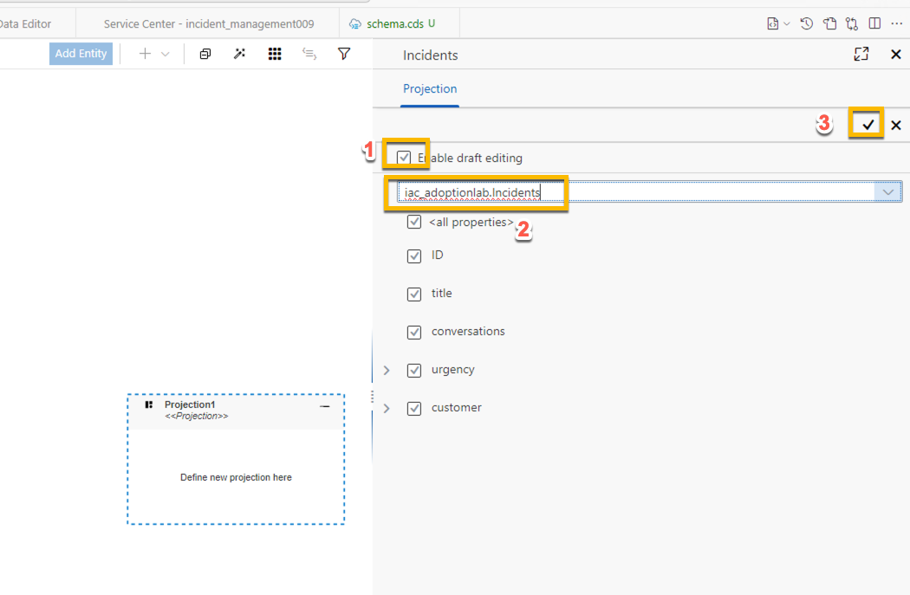

Incidents实体出现在CDS图形建模器中。

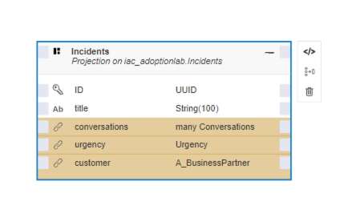

点击“打开属性表”图标，并导入S/4HANA Cloud OData服务。

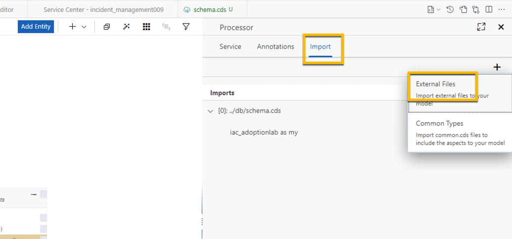

浏览OData CDS文件。

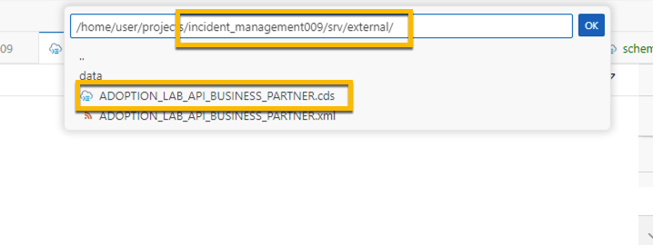

选择A_BusinessPartner实体。

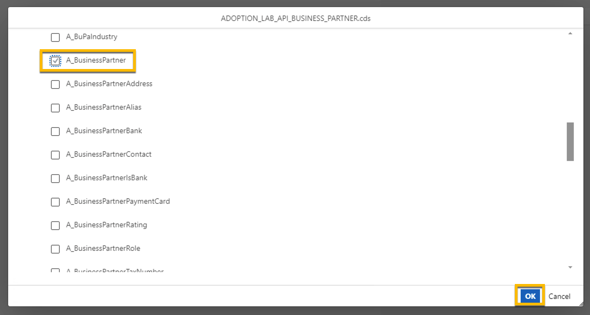

选择API_Busniess_Partner.A_BusinessPartner实体，清除“启用草稿编辑”复选框（如果未清除），并点击确定。
A_BusinessPartner实体出现在CDS图形建模器中。

**重要提示：更改名称为Customers**

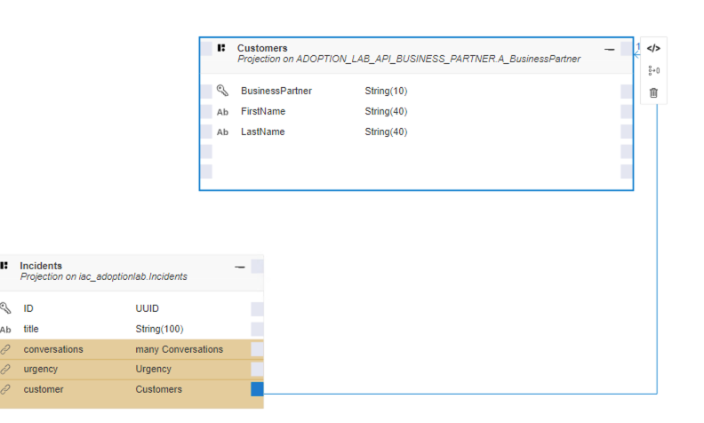

从工具栏中点击“添加实体”并选择“Entity1”。

**新投影对话框打开**

选择teched.Conversations实体，并清除“启用草稿编辑”复选框，点击确定。
Conversations实体出现在CDS图形建模器中。

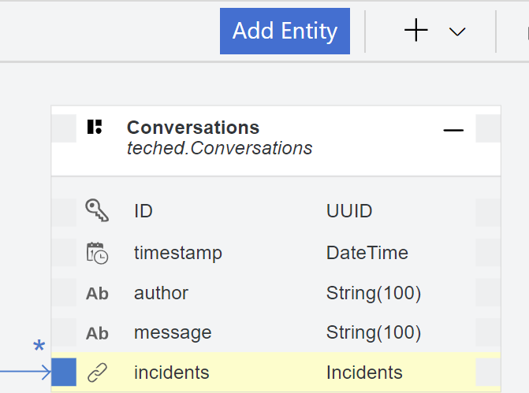

从工具栏中点击“添加实体”并选择“Entity1”。

**新投影对话框打开**

选择teched.Urgency实体，并清除“启用草稿编辑”复选框，点击确定。
Urgency实体出现在CDS图形建模器中。

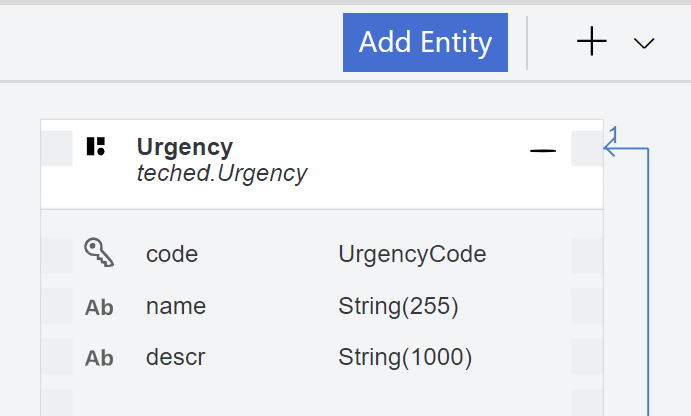

确认ProcessorService包含你刚刚添加的4个实体。

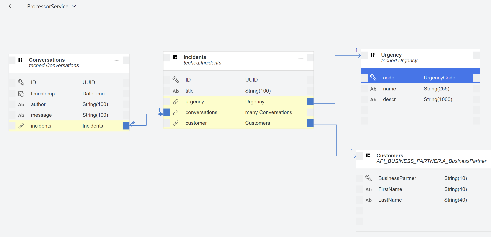

##### 总结
你现在已将一个**处理器服务（Processor）**添加到你的项目中。基本上，这个服务将会把你的数据模型暴露为一个OData V4, RESTful API给你的应用。

---

### 预览服务

我们现在有了一个服务，可以使用预示数据和实时数据来预览它而无需部署到云中。

##### 使用示例数据预览

从左侧的活动栏点击“运行配置”图标。这个视图打开。

点击默认的运行配置：**运行 incident_managementXXX-1**。
在打开的OData部分中，示例数据被选中。

从“运行配置”视图点击“运行模块图标”。

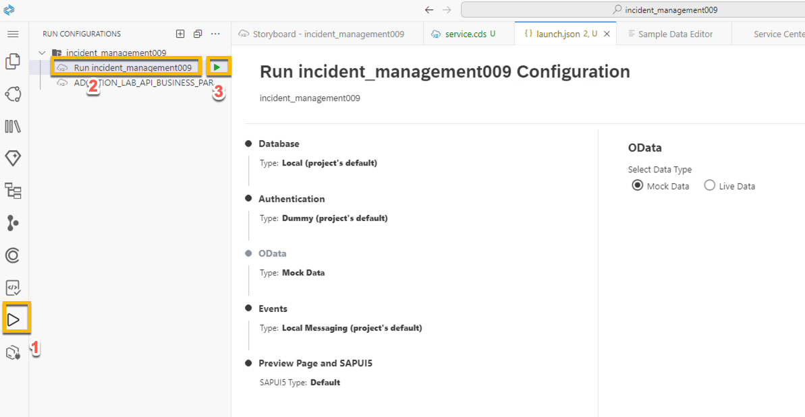

等待看到像下面的控制台输出为止：

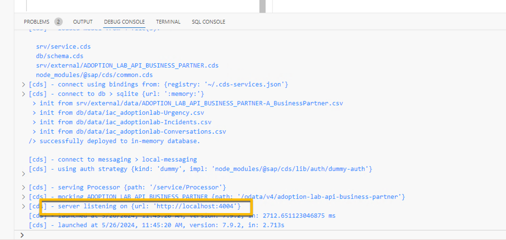

如果你的浏览器阻止了弹出窗口，请根据如下步骤解除：

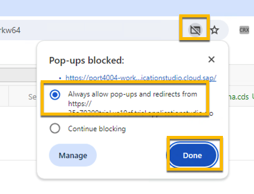

几秒钟后，一个新的浏览器标签页打开，并显示如下的屏幕

> 注意：如果没有新的标签，请检查是否在你的浏览器中运行了阻止器。如果是，允许SAP Business Application Studio域打开一个新的标签。


你可以在服务列表右侧看到包括**ProcessorService**在内的服务预览。
从“客户”行，点击“以代码形式查看”的图标来预览带有示例数据的客户列表。
客户样本数据显示出来，
使用OData V4查询和暴露数据。请注意，这个服务从内存数据库读取数据（在预览时自动开启），因此任何对数据的更改都不会保留。

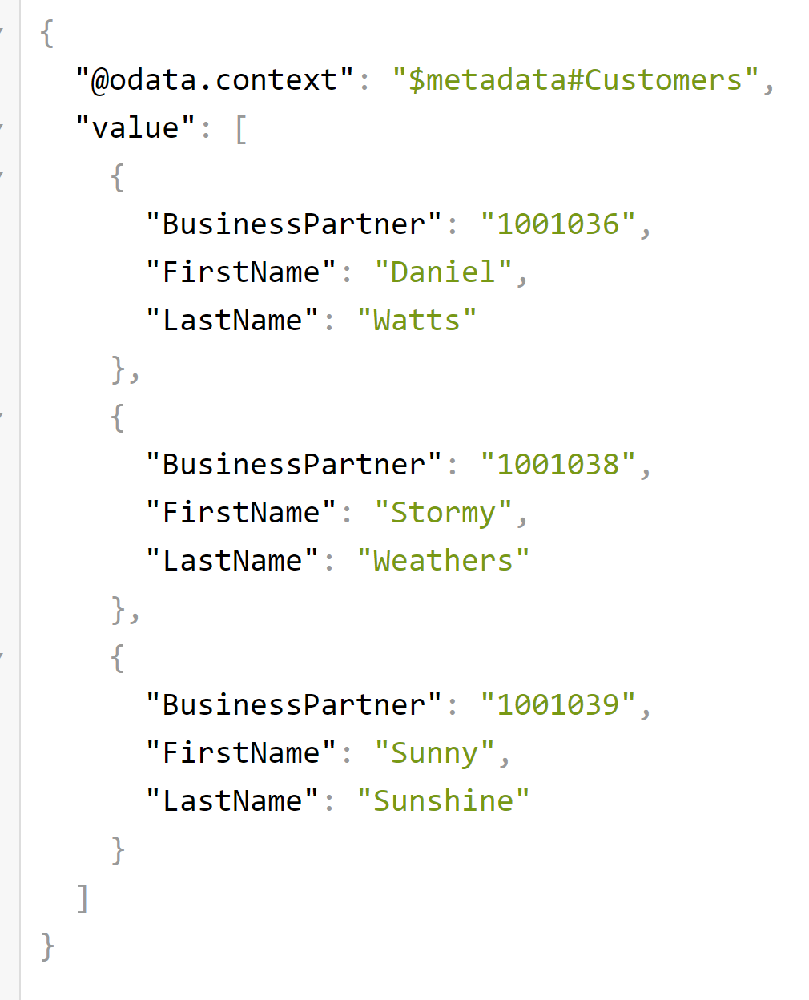

##### 使用实时数据预览

切换回显示你的项目的SAP Business Application Studio标签页。
我们现在将查看第二个版本的预览，使用实时数据。这次业务伙伴的数据实际上是从SAP S/4HANA Cloud系统获取的，而不是示例数据。

要进入实时数据预览，请先点击停止预览按钮。
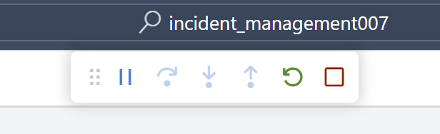

从活动栏中打开“运行配置”视图。

点击**API_BUSINESS_PARTNER**运行配置。
在编辑器的OData部分中选择“实时数据”。

从“运行配置”视图点击“运行模块图标”。

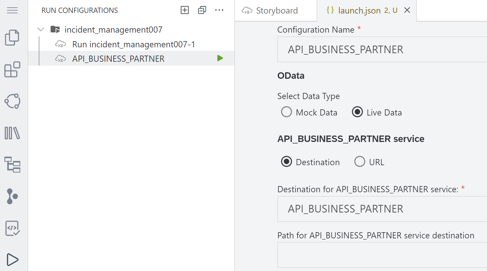

几秒钟后，一个新的浏览器标签页打开，并显示如下的屏幕：


> 注意：如果没有新的标签，请检查浏览器是否阻止了新的标签的打开。如果是，允许SAP Business Application Studio域打开一个新的标签。

服务预览出现，并在右侧的服务列表中显示**ProcessorService**。
从“客户”行，点击“以代码形式查看”的图标来预览客户列表。
这次你将得到比之前多得多的数据，并且名字也不同。这是来自SAP S/4HANA后端的真正业务伙伴数据。

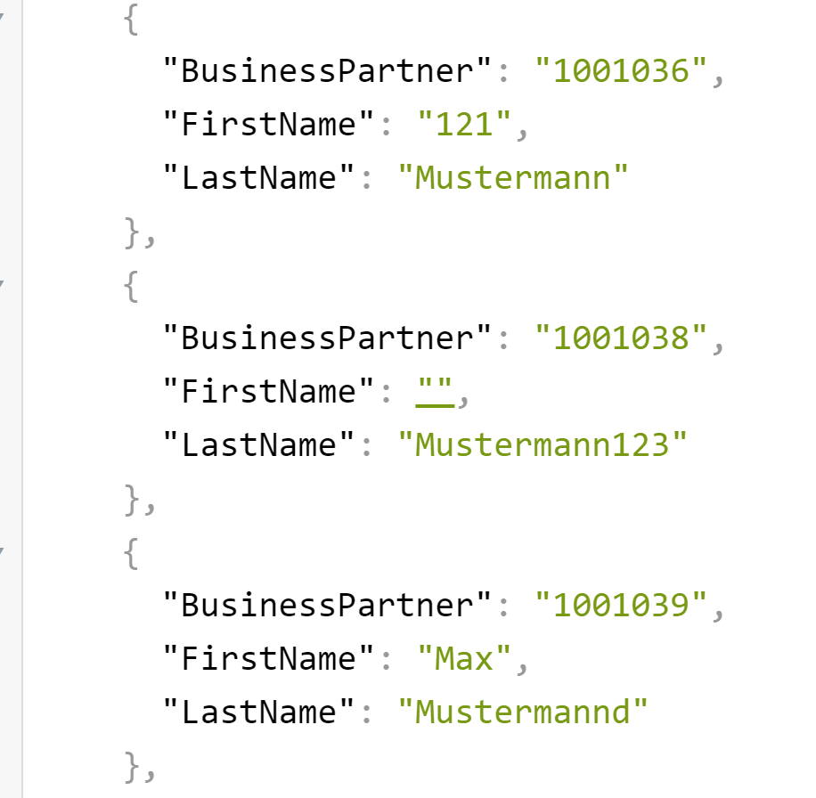

回到SAP Business Application Studio，并点击停止预览按钮。


##### 总结
我们现在已经无需部署服务就进行了预览。